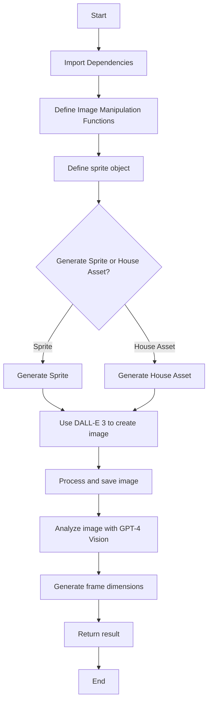

---
# High Level Context
## context
**Last Updated at:** 12/10/2024, 10:16:26 PM

Overview of index.js:

This code file contains functionality for generating and manipulating sprite images for use in game development, particularly with Phaser.js. The main components include:

1. Image manipulation functions (removeBackgroundColor, encodeImage, getUniqueColors)
2. A sprite object with methods for generating sprite sheets and house assets using OpenAI's DALL-E 3 model
3. Integration with OpenAI's GPT-4 Vision model to analyze generated images and determine appropriate frame dimensions

Mermaid Diagram:

The diagram shows the general flow of the code, starting with importing dependencies and defining functions, then moving on to the main sprite generation process. The code allows for either sprite or house asset generation, both using DALL-E 3. After image creation, the code processes the image and uses GPT-4 Vision to analyze it for appropriate frame dimensions. The final result is then returned.
