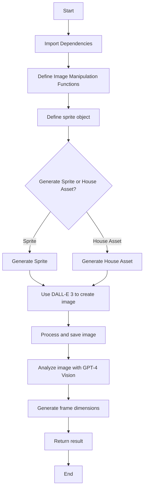

  ---
# High Level Context
## context
**Last Updated at:** 12/10/2024, 10:16:26 PM

Overview of index.js:

This code file contains functionality for generating and manipulating sprite images for use in game development, particularly with Phaser.js. The main components include:

1. Image manipulation functions (removeBackgroundColor, encodeImage, getUniqueColors)
2. A sprite object with methods for generating sprite sheets and house assets using OpenAI's DALL-E 3 model
3. Integration with OpenAI's GPT-4 Vision model to analyze generated images and determine appropriate frame dimensions

Mermaid Diagram:



The diagram shows the general flow of the code, starting with importing dependencies and defining functions, then moving on to the main sprite generation process. The code allows for either sprite or house asset generation, both using DALL-E 3. After image creation, the code processes the image and uses GPT-4 Vision to analyze it for appropriate frame dimensions. The final result is then returned.


---
# removeBackgroundColor /index.js
## Imported Code Object
**Last Updated at:** 2/11/2025, 6:27:07 PM

The code snippet defines an asynchronous function `removeBackgroundColor` that uses the Jimp library to process an image, replacing pixels of a specified color (or colors within a threshold) with transparency. It scans each pixel of the input image, compares it to the target color, and if the difference is within the threshold, it makes that pixel transparent before saving the result to the output path.

### Third Party libaries

Yes, this code does use a third-party library. It uses the Jimp library, which is a JavaScript image processing library.

You can see the use of Jimp in several places:

1. `Jimp.read(inputPath)` to read the input image.
2. `Jimp.cssColorToHex(targetColor)` to convert a CSS color to a hex value.
3. `Jimp.rgbaToInt(red, green, blue, 255)` to convert RGB values to an integer representation.
4. `Jimp.colorDiff()` to calculate the difference between two colors.
5. `Jimp.intToRGBA()` to convert an integer color representation back to RGBA.
6. The `image` object itself is an instance of Jimp, with methods like `scan()` and `writeAsync()`.

Jimp is a popular choice for image manipulation in JavaScript, especially in Node.js environments, as it provides a wide range of image processing capabilities without requiring native dependencies.

To use this code, you would need to install the Jimp library in your project, typically by running `npm install jimp` or `yarn add jimp`.

---

# image.scan() callback /index.js
## Imported Code Object
**Last Updated at:** 2/11/2025, 6:27:17 PM

The `image.scan()` method iterates over each pixel in the image, and the callback function is executed for each pixel, providing the x and y coordinates and an index (idx) to access the pixel data in the bitmap. This allows for pixel-level manipulation, where you can read and modify the color values of each pixel individually.

### Third Party libaries

Yes, this code is using a third-party library. The library being used here is Jimp (JavaScript Image Manipulation Program).

Jimp is an image processing library for Node.js that allows you to read, write, and manipulate images. In the code snippet you provided, several Jimp-specific methods and properties are being used:

1. `image.scan()`: This is a Jimp method used to iterate over each pixel in the image.

2. `this.bitmap.data`: This is accessing the raw pixel data of the Jimp image object.

3. `Jimp.rgbaToInt()`: A Jimp utility function to convert RGBA values to a single integer representation.

4. `Jimp.colorDiff()`: A Jimp utility function to calculate the difference between two colors.

5. `Jimp.intToRGBA()`: A Jimp utility function to convert an integer color representation back to RGBA values.

These methods and properties are not part of native JavaScript or Node.js; they are provided by the Jimp library. To use this code, you would need to install Jimp in your project (typically via npm) and import it at the top of your file.

---

# encodeImage /index.js
## Imported Code Object
**Last Updated at:** 2/11/2025, 6:27:26 PM

The `encodeImage` function reads an image file from the specified path using `fs.readFileSync()`, then converts it to a base64-encoded string using `Buffer.from(image).toString('base64')`, which is useful for embedding images directly in HTML or sending them as part of JSON data.

### Third Party libaries

No, this code does not use a third-party library. It uses built-in Node.js modules:

1. `fs` (File System): This is a core Node.js module used for interacting with the file system. In this case, it's used to read the image file.

2. `Buffer`: This is also a built-in Node.js class used to work with binary data. Here, it's used to convert the image data to a base64 string.

Here's a breakdown of what the code does:

1. `fs.readFileSync(imagePath)`: Reads the contents of the file at the specified path synchronously.
2. `Buffer.from(image)`: Creates a new Buffer object from the image data.
3. `.toString('base64')`: Converts the Buffer to a base64 encoded string.

All of these operations use standard Node.js functionality without relying on any external libraries.

---

# getUniqueColors /index.js
## Imported Code Object
**Last Updated at:** 2/11/2025, 6:27:37 PM

The `getUniqueColors` function in index.js is an asynchronous function that takes an image path and optional parameters, reads the image using Jimp library, scans through each pixel of the image, and returns an array of unique color values (represented as integers) found in the image, excluding fully transparent pixels. This function can be useful for analyzing the color palette of an image or extracting color information for various image processing tasks.

### Third Party libaries

Yes, this code does use a third-party library. It uses the Jimp library, which is a popular JavaScript image processing library.

You can see the use of Jimp in several places:

1. `await Jimp.read(imagePath)`: This line uses Jimp to read the image file.

2. `Jimp.rgbaToInt(red, green, blue, alpha)`: This is a Jimp method to convert RGBA values to an integer representation of the color.

3. `Jimp.intToRGBA(colorInt)`: This line is commented out, but it's another Jimp method that would convert the integer representation back to RGBA values.

Jimp provides a lot of functionality for image processing in JavaScript, including reading images, manipulating pixels, and various color conversion methods. In this specific code, it's being used to read the image and to handle color conversions.

To use this code, you would need to have Jimp installed in your project, typically via npm (Node Package Manager) with a command like `npm install jimp`.

---

# generateHouseAsset /index.js
## Imported Code Object
**Last Updated at:** 12/11/2024, 4:29:53 PM

The `generateHouseAsset` function is an asynchronous method that uses OpenAI's DALL-E 3 model to generate 2D game assets based on a given description, with options for multiple iterations or a single image generation. It returns either an array of image responses (if iterations are specified) or a single image response, utilizing the DALL-E 3 API to create visual assets suitable for use in a Phaser JS game.

### Third Party libaries

Yes, this code appears to use a third-party library. Specifically, it's using the OpenAI API, which is a third-party service for generating images using AI models like DALL-E 3.

Here are the key indicators:

1. The `openAiObject` variable, which is likely an instance of the OpenAI API client.

2. The use of `dalle3.generate()` method, which is part of the OpenAI API for image generation.

3. The `model: "dall-e-3"` parameter, which specifies the use of the DALL-E 3 model from OpenAI.

4. Other parameters like `prompt`, `n`, and `size` are consistent with the OpenAI image generation API.

To use this code, you would need to have the OpenAI library installed in your project and properly configured with your API key. The OpenAI library is not a built-in part of JavaScript or Node.js, so it's definitely a third-party dependency.


---
# generateSprite /index.js
## Imported Code Object
**Last Updated at:** 2/11/2025, 6:42:38 PM

The `generateSprite` function in this code snippet is an asynchronous method that uses OpenAI's DALL-E 3 to generate sprite sheets based on a given description, and then uses GPT-4 Vision to analyze the generated image for appropriate frame dimensions. It includes options for multiple iterations, image processing (like rotation and tinting), and metadata generation, making it a versatile tool for creating and manipulating game sprites programmatically.

### Third Party libaries

Yes, this code does use several third-party libraries. Here are the main ones I can identify:

1. OpenAI: The code uses the OpenAI API to generate images and process text. This is evident from lines like `const openAiObject = new OpenAI();` and the use of models like "dall-e-3" and "gpt-4-vision-preview".

2. Axios: Used for making HTTP requests, as seen in the line `const res = await axios.get(response.data[0].url, { responseType: 'arraybuffer' });`

3. Sharp: A high-performance image processing library for Node.js. It's used for various image manipulations like greyscale conversion, alpha channel handling, and resizing. Examples include `await sharp(imgBuffer).ensureAlpha().greyscale().toBuffer()`.

4. Buffer: While not a third-party library (it's part of Node.js core), it's used extensively for handling binary data.

5. Path: Also a Node.js core module, used for file path operations.

Additionally, the code seems to reference some custom functions that might be defined elsewhere in the project, such as:

- `rotateSpritesheet`
- `tintSprite`
- `generateSpriteMetadata`

These might be using additional libraries or could be custom implementations.

The code also interacts with the file system (for saving images) and uses features like async/await, indicating it's running in a Node.js environment.

---

# sprite.generateSprite index.js
## Imported Code Object
The `sprite.generateSprite` function in this code snippet is an asynchronous method that generates a sprite image and its associated frame dimensions using AI services. Here's a concise explanation of its main functionalities:

1. It uses DALL-E 3 to generate a 6-frame sprite sheet based on a given description.
2. The generated image is processed (converted to grayscale) and optionally saved.
3. It then uses GPT-4 Vision to analyze the generated image and determine appropriate frame dimensions for use in Phaser.js.
4. Finally, it uses GPT-3.5 to format the frame dimensions into a JSON object.

The function can operate in two modes:
- Single generation: Returns a single sprite image and its frame dimensions.
- Multiple iterations: Generates multiple sprite images and frame dimensions when the `iterations` option is specified.

The result includes the generated image(s) as a data URL and the suggested frame dimensions in JSON format.

### Third Party libaries

Yes, this code does use several third-party libraries. Here are the main ones:

1. OpenAI: The code uses the OpenAI API to generate images with DALL-E 3 and to make chat completions with GPT-4 Vision and GPT-3.5 Turbo.

2. axios: This is used to make HTTP requests, specifically to download the image generated by DALL-E.

3. sharp: This image processing library is used to manipulate the downloaded image (converting to grayscale, ensuring alpha channel, etc.).

4. path: While this is a built-in Node.js module, it's used here for file path operations.

5. Buffer: This is a built-in Node.js class used for handling binary data.

Additionally, the code seems to be part of a larger system or framework, possibly using:

6. Phaser: While not directly used in this code snippet, the comments reference Phaser.js, a game framework for HTML5.

The main functionalities that rely on third-party libraries are:

- Image generation (OpenAI's DALL-E 3)
- Image analysis (OpenAI's GPT-4 Vision)
- Text generation and parsing (OpenAI's GPT-3.5 Turbo)
- HTTP requests (axios)
- Image processing (sharp)

These libraries significantly extend the capabilities of the code beyond what's available in standard JavaScript or Node.js.

  
---
# removeBackgroundColor index.js
## Imported Code Object
The `removeBackgroundColor` function is an asynchronous function that processes an image to remove a specified background color. Here's a concise explanation of its functionality:

1. It takes an input image file path, an output file path, a target color to remove, and optional parameters for color threshold and additional options.

2. The function uses the Jimp library to read and process the image.

3. It converts the target color to a hex value.

4. The function then scans through each pixel of the image:
   - It compares the color of each pixel to the target color.
   - If the difference between the pixel color and the target color is within the specified threshold, it makes that pixel transparent by setting its alpha value to 0.

5. Finally, it saves the processed image to the specified output path and returns the result.

In essence, this function allows you to remove a specific background color from an image by replacing it with transparency, with some flexibility in color matching through the threshold parameter.

### Third Party libaries

Yes, this code does use a third-party library. It uses the Jimp library for image processing. Jimp (JavaScript Image Manipulation Program) is a popular image processing library for Node.js.

Here are the key indicators that Jimp is being used:

1. `Jimp.read(inputPath)`: This is used to read the input image file.

2. `Jimp.cssColorToHex(targetColor)`: This converts a CSS color string to a hexadecimal color value.

3. `image.scan()`: This is a Jimp method used to iterate over each pixel in the image.

4. `Jimp.rgbaToInt()` and `Jimp.intToRGBA()`: These are Jimp utility functions for converting between RGBA and integer color representations.

5. `Jimp.colorDiff()`: This is used to calculate the difference between two colors.

6. `image.writeAsync(outputPath)`: This is a Jimp method to save the processed image to a file.

So, while the function `removeBackgroundColor` itself is custom-written, it heavily relies on the Jimp library to perform the actual image processing tasks. Jimp provides the necessary tools and methods to read, manipulate, and write image files, which are utilized in this function to remove the background color based on a target color and threshold.

  

---
# rotateSpritesheet /index.js
## Imported Code Object
**Last Updated at:** 2/11/2025, 6:27:47 PM

This code defines an asynchronous function `rotateSpritesheet` that takes an input buffer and rotation degrees, uses the Sharp library to rotate the image, and returns the rotated image as a buffer. It's likely part of a module or file named "rotateSpritesheet/index.js" that handles image rotation operations for sprite sheets in a larger project.

### Third Party libaries

Yes, this code uses a third-party library called Sharp. Sharp is a high-performance Node.js image processing library.

Here's a breakdown of how Sharp is being used in this code:

1. `sharp(inputBuffer)`: This creates a Sharp instance with the provided input buffer.

2. `.rotate(degrees)`: This applies a rotation to the image by the specified number of degrees.

3. `.toBuffer()`: This converts the processed image back into a buffer.

Sharp is a popular choice for image processing tasks in Node.js due to its speed and extensive feature set. It's designed to be efficient with both memory and CPU, making it suitable for processing large images or handling high volumes of image operations.

To use this code, you would need to install Sharp in your project using npm:

```
npm install sharp
```

And then import it at the top of your file:

```javascript
const sharp = require('sharp');
```

Remember that Sharp is not a built-in Node.js module, so it needs to be installed separately in your project.


---
# tintSprite /index.js
## Imported Code Object
**Last Updated at:** 2/11/2025, 6:27:57 PM

The `tintSprite` function is an asynchronous operation that takes an input image buffer and a color, applies a tint effect to the image using the Sharp image processing library, and returns the modified image as a buffer. Here's a concise example:

```javascript
const sharp = require('sharp');

async function tintSprite(inputBuffer, color) {
  return await sharp(inputBuffer).tint(color).toBuffer();
}
```

### Third Party libaries

Yes, this code uses a third-party library called "sharp".

Sharp is a high-performance Node.js image processing library. It's commonly used for resizing, formatting, and manipulating images. In this specific code snippet, the sharp library is being used to apply a tint to an image.

Here's a breakdown of what's happening:

1. The `sharp()` function is called with `inputBuffer`, which is likely a buffer containing image data.

2. The `.tint()` method is then called on the sharp object. This method applies a tint of the specified `color` to the image.

3. Finally, `.toBuffer()` is called to convert the processed image back into a buffer.

To use this code, you would need to have the sharp library installed in your project. You can install it using npm:

```
npm install sharp
```

And you would typically import it at the top of your file like this:

```javascript
const sharp = require('sharp');
```

or using ES6 import syntax:

```javascript
import sharp from 'sharp';
```

So, in summary, yes, this code is using the third-party "sharp" library for image processing.


---
# calculateOptimalAnimationSpeed /index.js
## Imported Code Object
**Last Updated at:** 2/11/2025, 6:28:06 PM

The calculateOptimalAnimationSpeed function calculates the optimal speed for an animation based on the number of frames, aiming to maintain a smooth 60 FPS animation by adjusting the frame rate. It takes the total number of frames as input and returns the number of frames that should be displayed per second to achieve a smooth animation at 60 FPS.

### Third Party libaries

No, this code does not use any third-party library. It's a simple JavaScript function that performs a basic calculation using native JavaScript features. Here's a breakdown:

1. The function is defined as `async`, but it doesn't actually use any asynchronous operations inside.

2. It takes a parameter `frameCount`.

3. It defines a constant `baseFrameRate` with a value of 60, which is a common frame rate for smooth animations.

4. It then calculates and returns the result of dividing `baseFrameRate` by `frameCount`, rounded down to the nearest integer using `Math.floor()`.

All of these operations (function definition, arithmetic operations, and `Math.floor()`) are part of standard JavaScript and don't require any external libraries or dependencies.


---
# generateSpriteMetadata /index.js
## Imported Code Object
**Last Updated at:** 2/11/2025, 6:28:16 PM

The `generateSpriteMetadata` function in this code snippet is responsible for analyzing an image buffer of a sprite sheet and generating metadata about its structure, including frame dimensions, total frames, and recommended animation speed. It uses the `sharp` library to extract image information and calculates various properties of the sprite sheet based on the provided frame width and height.

### Third Party libaries

Yes, this code does use a third-party library. It's using the `sharp` library, which is a popular Node.js module for image processing.

You can see this in the line:

```javascript
const metadata = await sharp(imageBuffer).metadata();
```

The `sharp` library is being used to read metadata from the image buffer. Sharp is known for its high performance and is commonly used for resizing images and other image manipulation tasks in Node.js applications.

To use this code, you would need to install the `sharp` library in your project, typically by running:

```
npm install sharp
```

And then you would need to import it at the top of your file:

```javascript
const sharp = require('sharp');
```

or if you're using ES modules:

```javascript
import sharp from 'sharp';
```

The rest of the code doesn't appear to use any other third-party libraries. It's using standard JavaScript math operations and object literals to calculate and return the sprite metadata.


---
# createParticleEffect /index.js
## Imported Code Object
**Last Updated at:** 2/11/2025, 6:28:25 PM

The `createParticleEffect` function generates an array of particle images by resizing and rotating the input image multiple times, creating smaller versions with random sizes and rotations. It uses the Sharp library for image processing and returns an array of image buffers representing the particles.

### Third Party libaries

Yes, this code uses a third-party library called "sharp". Sharp is a high-performance Node.js image processing library.

In the code, you can see the use of `sharp` in several places:

1. `const metadata = await sharp(imageBuffer).metadata();`
2. `const particle = await sharp(imageBuffer)...`

Sharp is being used to:

1. Get metadata about the input image.
2. Resize the image to create smaller versions for particles.
3. Rotate the images randomly.
4. Convert the processed images to buffers.

To use this code, you would need to install the sharp library in your Node.js project. You can do this using npm (Node Package Manager) with the following command:

```
npm install sharp
```

Then, at the top of your file, you would need to import sharp:

```javascript
const sharp = require('sharp');
```

Sharp is a powerful library for image processing in Node.js, offering high performance and a wide range of capabilities.


---
# flipSprite /index.js
## Imported Code Object
**Last Updated at:** 2/11/2025, 6:28:35 PM

The `flipSprite` function in this code snippet is an asynchronous function that takes an image buffer and a direction ('horizontal' or 'vertical') as input, and uses the Sharp image processing library to flip or flop the image accordingly, returning the modified image as a buffer. It provides a simple way to mirror an image either horizontally or vertically using the Sharp library's `flip` and `flop` methods.

### Third Party libaries

Yes, this code uses a third-party library called Sharp. Sharp is a high-performance Node.js image processing library.

Here's a breakdown of how the code is using Sharp:

1. `sharp(imageBuffer)`: This creates a Sharp instance with the provided image buffer.

2. `.flip(direction === 'vertical')`: This method flips the image vertically if the `direction` parameter is 'vertical'.

3. `.flop(direction === 'horizontal')`: This method flips the image horizontally if the `direction` parameter is 'horizontal'.

4. `.toBuffer()`: This converts the processed image back to a buffer.

To use this code, you would need to have Sharp installed in your project. You can install it using npm:

```
npm install sharp
```

And you would typically import it at the top of your file like this:

```javascript
const sharp = require('sharp');
```

Sharp is a powerful library that provides many image processing capabilities beyond just flipping images. It's known for its performance and is widely used in Node.js applications that require image manipulation.


---
# createColorCyclingAnimation /index.js
## Imported Code Object
**Last Updated at:** 2/11/2025, 6:28:46 PM

The `createColorCyclingAnimation` function generates a series of image frames by applying color shifts to an input image, creating a color cycling effect. It uses the Sharp library to manipulate the image's hue in increments, producing an array of modified image buffers that can be used to create an animated sequence.

### Third Party libaries

Yes, this code uses a third-party library called "sharp". Sharp is a high-performance Node.js image processing library.

In the code snippet you provided, the `sharp` function is being used to manipulate the image. Specifically:

1. `sharp(imageBuffer)` creates a sharp instance from the provided image buffer.

2. `.modulate({ hue: i })` is used to adjust the hue of the image. This is part of sharp's color manipulation functionality.

3. `.toBuffer()` converts the processed image back into a buffer.

Sharp is not a built-in Node.js module, so it would need to be installed separately, typically via npm (Node Package Manager) with a command like:

```
npm install sharp
```

And it would need to be imported at the top of the file, likely with a line like:

```javascript
const sharp = require('sharp');
```

or using ES6 import syntax:

```javascript
import sharp from 'sharp';
```

Sharp is widely used for its speed and efficiency in image processing tasks in Node.js environments.


---
# combineSprites /index.js
## Imported Code Object
**Last Updated at:** 2/11/2025, 6:38:58 PM

The `combineSprites` function likely comes from an external module or file (possibly named 'index.js') that provides functionality to merge two sprite images. It takes two image buffers and a position parameter, combines the sprites accordingly, and returns the resulting combined image buffer.

### Third Party libaries

Based on the code snippet you provided, it appears that this function is using a third-party library or module called `combineSprites`. This is evident from the line:

```javascript
const combined = await combineSprites(buffer1, buffer2, position);
```

Here, `combineSprites` is being called as a function, but it's not defined within the code snippet you've shown. This suggests that it's likely imported from an external library or another module in your project.

However, without seeing the full context of the file or the project structure, it's not possible to determine exactly which library this `combineSprites` function comes from. It could be:

1. A custom module defined elsewhere in your project.
2. A third-party library specifically for sprite manipulation.
3. A function from a more general image processing library.

To know for sure, you'd need to check:

1. The import statements at the top of the file.
2. The package.json file for any relevant dependencies.
3. Other files in the project that might define this function.

If you need more specific information about the `combineSprites` function, you should look for its definition or documentation within your project or the library it comes from.

---

# generateOutline /index.js
## Imported Code Object
**Last Updated at:** 2/11/2025, 6:29:07 PM

The `generateOutline` function is an asynchronous method that creates an outline effect around an image using the Sharp image processing library. It works by dilating the image, compositing it with the original, and then applying color to create the outline, as demonstrated in the code snippet.

### Third Party libaries

Yes, this code uses a third-party library called Sharp. Sharp is a high-performance Node.js image processing library that is commonly used for resizing, converting, and manipulating images.

In this code:

1. `sharp()` is used to create Sharp instances for image processing.
2. Various Sharp methods are used, such as:
   - `toBuffer()`: to convert the image to a buffer
   - `dilate()`: to expand the image
   - `composite()`: to combine images
   - `negate()`: to invert the image
   - `tint()`: to apply a color tint to the image

To use this code, you would need to install the Sharp library in your Node.js project. This can typically be done using npm:

```
npm install sharp
```

And then you would need to import it at the top of your file:

```javascript
const sharp = require('sharp');
```

Sharp is not part of the standard Node.js library, so it's considered a third-party dependency for this code.


---
# pixelSort /index.js
## Imported Code Object
**Last Updated at:** 2/11/2025, 6:29:16 PM

The `pixelSort` function is an asynchronous operation that takes an image buffer, extracts its pixel data, sorts the pixels based on a specified criterion (brightness or red channel), and then reconstructs the image with the sorted pixels. It utilizes the `sharp` library for image processing and returns a new buffer containing the sorted image data.

### Third Party libaries

Yes, this code does use a third-party library. It uses the `sharp` library for image processing.

Sharp is a high-performance Node.js image processing library. It's used in this code for several purposes:

1. To read the input image buffer:
   ```javascript
   const { data, info } = await sharp(imageBuffer)
     .raw()
     .toBuffer({ resolveWithObject: true });
   ```

2. To create a new image from the sorted pixel data:
   ```javascript
   return await sharp(sortedData, {
     raw: { width: info.width, height: info.height, channels: 4 }
   }).toBuffer();
   ```

Sharp is not a built-in Node.js module, so it needs to be installed separately, typically via npm (Node Package Manager) with a command like `npm install sharp`.

The rest of the code (the pixel sorting logic) is implemented using standard JavaScript without any additional libraries.


---
# pixels.forEach() callback /index.js
## Imported Code Object
**Last Updated at:** 2/11/2025, 6:29:31 PM

The `pixels.forEach()` callback in this code snippet iterates over each pixel in the `pixels` array, accessing its RGBA values and storing them in the `sortedData` array in a contiguous block format where each pixel occupies 4 consecutive elements (R, G, B, A). The `idx` parameter is used to calculate the target index in `sortedData` for each pixel's color components.

### Third Party libaries

The code snippet you provided does not inherently use a third-party library. It's using standard JavaScript array methods and syntax. Here's a breakdown:

1. `pixels.forEach()`: This is a standard JavaScript array method available on all arrays.

2. The arrow function `(pixel, idx) => { ... }` is standard ES6+ JavaScript syntax.

3. The structure of the `pixel` object (with `r`, `g`, `b`, and `a` properties) and the use of `sortedData` array suggest that this code is likely working with image data, possibly in the context of canvas manipulation or image processing.

However, the origin of the `pixels` array and `sortedData` array is not shown in this snippet. These could be coming from:

1. Built-in Web APIs like Canvas API
2. A custom data structure you've created
3. Potentially, a third-party library that provides image manipulation functions

To definitively say whether a third-party library is involved, we'd need to see more of the surrounding code, particularly where `pixels` and `sortedData` are defined and initialized.

If this is part of a larger image processing application, it's possible that a library like p5.js, Jimp, or another image manipulation library might be used elsewhere in the code. But the specific snippet you've shown doesn't directly use any third-party library functions.


---
# pixels.sort() callback /index.js
## Imported Code Object
**Last Updated at:** 2/11/2025, 6:29:41 PM

The `pixels.sort()` callback function in this code snippet is a comparison function that determines the sorting order of pixels based on either brightness (average of RGB values) or just the red channel, depending on the `sortMode`. It returns a negative value if `a` should be sorted before `b`, a positive value if `b` should be sorted before `a`, or zero if they're equal, following JavaScript's array sorting convention.

### Third Party libaries

No, this code does not use a third-party library. It's using standard JavaScript array methods and syntax:

1. `pixels.sort()` is a built-in JavaScript array method that sorts the elements of an array in place.

2. The arrow function `(a, b) => { ... }` is the comparison function passed to `sort()`. This is standard ES6+ JavaScript syntax.

3. The `if` statement and the arithmetic operations inside the function are all basic JavaScript.

4. The properties `r`, `g`, and `b` are assumed to be properties of the objects in the `pixels` array, but these are just accessing object properties, which is standard JavaScript.

5. The `sortMode` variable is assumed to be defined elsewhere in the code, but it's just a regular JavaScript variable.

This code is sorting an array of pixel objects based on either their brightness (calculated as the average of red, green, and blue values) or just their red value, depending on the `sortMode`. All of this is accomplished using standard JavaScript features without any external libraries.


---
# addNoise /index.js
## Imported Code Object
**Last Updated at:** 2/11/2025, 6:29:51 PM

The `addNoise` function takes an image buffer and adds random noise to each pixel's RGB values, while preserving transparency. It uses the `sharp` library to process the image, applies the noise in a loop, and then returns the modified image as a new buffer.

### Third Party libaries

Yes, this code does use a third-party library. It uses the `sharp` library, which is a high-performance Node.js image processing library.

The `sharp` library is used in several places in this code:

1. To convert the input image buffer to raw pixel data:
   ```javascript
   const { data, info } = await sharp(imageBuffer)
     .raw()
     .toBuffer({ resolveWithObject: true });
   ```

2. To create a new image from the modified pixel data:
   ```javascript
   return await sharp(data, {
     raw: { width: info.width, height: info.height, channels: 4 }
   }).toBuffer();
   ```

The `sharp` library is handling the low-level image processing tasks, such as decoding the input image, providing access to raw pixel data, and encoding the modified data back into an image buffer.

The rest of the code (the loop that adds noise to the pixels) is using standard JavaScript without any additional libraries.


---
# extractPalette /index.js
## Imported Code Object
**Last Updated at:** 2/11/2025, 6:30:01 PM

The `extractPalette` function is a utility that processes an image buffer to extract the most prominent colors, up to a specified maximum number. It uses the Sharp library to convert the image to raw pixel data, then counts color occurrences, sorts them by frequency, and returns an array of the top colors in RGB format.

### Third Party libaries

Yes, this code does use a third-party library. It uses the `sharp` library for image processing.

The `sharp` library is being used in this line:

```javascript
const { data, info } = await sharp(imageBuffer)
  .raw()
  .toBuffer({ resolveWithObject: true });
```

Sharp is a high-performance Node.js image processing library. In this code, it's being used to:

1. Take an image buffer as input
2. Convert the image to raw pixel data
3. Return this data along with image information

The rest of the function then processes this raw pixel data to extract the color palette.

So while the color extraction algorithm itself is implemented without additional libraries, the initial image processing step relies on the `sharp` library to handle the conversion of the image to raw pixel data.


---
# map() callback /index.js
## Imported Code Object
**Last Updated at:** 2/11/2025, 6:30:10 PM

In this code snippet, `map()` is used twice: the outer `map()` transforms each element of an array, while the inner `map(Number)` converts each split string to a number. The `([color])` is array destructuring, extracting the first element of each sub-array.

### Third Party libaries

No, this code does not use any third-party library. It's using built-in JavaScript methods:

1. `.map()`: This is a built-in array method in JavaScript.
2. `[color]`: This is array destructuring, a feature of modern JavaScript.
3. `.split(',')`: This is a built-in string method in JavaScript.
4. `Number`: This is a built-in JavaScript function used to convert a string to a number.

This line of code is doing the following:

1. It's using `.map()` on an array of arrays.
2. For each inner array, it's extracting the first element (assuming it's a string) using destructuring.
3. It's then splitting this string by commas.
4. Finally, it's converting each resulting string to a number.

All of these are standard JavaScript features and don't require any external libraries.


---
# sort() callback /index.js
## Imported Code Object
**Last Updated at:** 2/11/2025, 6:30:22 PM

The sort() callback in this code snippet is a comparison function that determines the sorting order of elements based on their second array item (index 1). It sorts the elements in descending order by subtracting the second item of 'a' from the second item of 'b', resulting in larger values being placed before smaller ones.

### Third Party libaries

No, this code does not use a third-party library. It's using JavaScript's built-in `sort()` method, which is a standard feature of JavaScript arrays.

The `sort()` method can take an optional comparison function as an argument. In this case, the comparison function is provided as an arrow function:

```javascript
(a, b) => b[1] - a[1]
```

This function is used to determine the order of elements in the sorted array. It compares two elements (a and b) based on their second elements (index 1) in descending order.

Here's a breakdown:

1. `sort()` is a built-in method for JavaScript arrays.
2. The arrow function `(a, b) => b[1] - a[1]` is the comparison function.
3. `a` and `b` represent two elements being compared.
4. `a[1]` and `b[1]` access the second element of each item (assuming they are arrays or array-like objects).
5. `b[1] - a[1]` returns a positive number if b's second element is larger, a negative number if a's second element is larger, or zero if they're equal.

This particular sort will arrange the elements in descending order based on their second elements. It's all standard JavaScript, no third-party libraries involved.


---
# pixelPerfectScale /index.js
## Imported Code Object
**Last Updated at:** 2/11/2025, 6:30:33 PM

The `pixelPerfectScale` function is an asynchronous utility that uses the Sharp library to resize an image buffer by a specified scale factor (default 2x), employing the 'nearest neighbor' interpolation method to maintain pixel-perfect scaling. This function is particularly useful for scaling pixel art or retro-style graphics while preserving their crisp, blocky appearance.

### Third Party libaries

Yes, this code uses a third-party library called Sharp. Sharp is a high-performance Node.js image processing library.

Here's how the Sharp library is used in this code:

1. `sharp(imageBuffer)`: This creates a Sharp instance with the input image buffer.

2. `.metadata()`: This method is used to retrieve metadata about the image, including its dimensions.

3. `.resize()`: This is a Sharp method used to resize the image. It's using the 'nearest' kernel, which is good for pixel art scaling as it maintains sharp edges.

4. `.toBuffer()`: This Sharp method is used to output the processed image as a buffer.

The `sharp` function is not a built-in Node.js function, so this code definitely relies on the Sharp library. You would need to install Sharp (typically via npm) and import it at the top of your file for this code to work.

If you're using this code, make sure you have Sharp installed in your project. You can install it using npm:

```
npm install sharp
```

And then import it at the top of your file:

```javascript
const sharp = require('sharp');
```

or if you're using ES modules:

```javascript
import sharp from 'sharp';
```


---
# generateShadow /index.js
## Imported Code Object
**Last Updated at:** 2/11/2025, 6:30:43 PM

The `generateShadow` function is an asynchronous JavaScript function that takes an image buffer and shadow options as inputs, and uses the Sharp image processing library to create a shadow effect for the image. It applies various transformations to the image buffer, such as negating, blurring, and tinting, to generate the shadow, and then composites the original image on top of the shadow to produce the final result.

### Third Party libaries

Yes, this code uses a third-party library called "sharp". Sharp is a high-performance Node.js image processing library that is commonly used for resizing, converting, and manipulating images.

In the code you provided, sharp is used extensively to perform various image processing operations:

1. `sharp(imageBuffer)` - Creates a sharp instance from the input image buffer.
2. `.negate()` - Inverts the image colors.
3. `.linear()` - Applies a linear transformation to the image (used here for opacity).
4. `.blur()` - Applies a Gaussian blur to the image.
5. `.tint()` - Applies a color tint to the image.
6. `.extend()` - Extends the edges of the image.
7. `.toBuffer()` - Outputs the processed image as a buffer.
8. `.composite()` - Combines multiple images.

These methods are all part of the sharp library's API. The library needs to be installed (typically via npm) and imported into your project to use this code.


---
# createMirrorEffect /index.js
## Imported Code Object
**Last Updated at:** 2/11/2025, 6:30:53 PM

The `createMirrorEffect` function is an asynchronous function that creates a mirror effect on an image by flipping or flopping it, optionally applying a fade effect, and then compositing it with the original image using the Sharp image processing library. It takes an image buffer as input, along with optional parameters for the direction of the mirror effect and whether to apply a fade, and returns a new image buffer with the mirror effect applied.

### Third Party libaries

Yes, this code uses a third-party library called "sharp". Sharp is a high-performance Node.js image processing library that's commonly used for resizing, format conversion, and various image manipulations.

In this code:

1. `sharp(imageBuffer)` is used to create a Sharp instance from the input image buffer.

2. Methods like `flip()`, `flop()`, `linear()`, and `composite()` are all part of the Sharp API.

3. `toBuffer()` is used to output the processed image as a buffer.

To use this code, you would need to install the Sharp library in your Node.js project using npm:

```
npm install sharp
```

And then import it at the top of your file:

```javascript
const sharp = require('sharp');
```

Sharp is not a built-in Node.js module, so it's considered a third-party library. It's a popular choice for image processing tasks in Node.js due to its speed and extensive feature set.


---
# interpolateFrames /index.js
## Imported Code Object
**Last Updated at:** 2/11/2025, 6:31:03 PM

The `interpolateFrames` function creates a smooth transition between two image frames by generating intermediate frames, blending the second frame over the first with increasing opacity for each step. It uses the Sharp library to perform image processing and returns an array of buffered frames representing the transition sequence.

### Third Party libaries

Yes, this code does use a third-party library. It's using the `sharp` library, which is a high-performance Node.js image processing library.

Here's how the `sharp` library is being used in this code:

1. `sharp(frame1Buffer)`: This creates a new Sharp instance from the first frame buffer.

2. `.composite([...])`: This method is used to composite (overlay) one image on top of another. In this case, it's overlaying the second frame on top of the first frame.

3. `.toBuffer()`: This converts the processed image back into a buffer.

The `sharp` library is not part of Node.js core, so it needs to be installed separately, typically via npm (Node Package Manager) with a command like `npm install sharp`.

This function, `interpolateFrames`, is using `sharp` to create a series of intermediate frames between two given frames (frame1Buffer and frame2Buffer). It does this by gradually increasing the opacity of the second frame overlaid on the first frame, creating a smooth transition effect.


---
# createReflection /index.js
## Imported Code Object
**Last Updated at:** 2/11/2025, 6:31:13 PM

The `createReflection` function is an asynchronous JavaScript function that takes an image buffer and optional reflection parameters to create a reflected version of the image. It uses the Sharp library to manipulate the image, creating a reflection effect by flipping the image, resizing it, applying a gradient for fading (if specified), and then compositing the reflection with the original image.

### Third Party libaries

Yes, this code uses a third-party library called Sharp. Sharp is a high-performance Node.js image processing library that is commonly used for resizing, converting, and manipulating images.

In this code, Sharp is used extensively for various image processing tasks:

1. Reading image metadata: `sharp(imageBuffer).metadata()`
2. Flipping the image: `.flip(flipY)`
3. Resizing the image: `.resize({ height: reflectionHeight, fit: 'contain' })`
4. Compositing images: `.composite([...])`
5. Extending the image canvas: `.extend({...})`
6. Converting images to buffers: `.toBuffer()`

Sharp provides these methods to efficiently perform complex image manipulations. It's a popular choice for image processing in Node.js applications due to its speed and versatility.

To use this code, you would need to install the Sharp library in your project, typically by running `npm install sharp` or `yarn add sharp` in your project directory.


---
# createWaveDistortion /index.js
## Imported Code Object
**Last Updated at:** 2/11/2025, 6:31:23 PM

The `createWaveDistortion` function applies a wave-like distortion effect to an input image buffer, creating animated frames if specified. It uses the Sharp library to process the image, calculates wave offsets based on provided parameters, and returns an array of distorted image frames.

### Third Party libaries

Yes, this code does use a third-party library. It uses the `sharp` library, which is a high-performance Node.js image processing library.

You can see the `sharp` library being used in several places in the code:

1. To get metadata from the input image:
   ```javascript
   const metadata = await sharp(imageBuffer).metadata();
   ```

2. To convert the image to raw pixel data:
   ```javascript
   const { data, info } = await sharp(imageBuffer)
     .raw()
     .toBuffer({ resolveWithObject: true });
   ```

3. To create new image buffers from the processed pixel data:
   ```javascript
   const frame = await sharp(newData, {
     raw: { width: info.width, height: info.height, channels: 4 }
   }).toBuffer();
   ```

The `sharp` library is used here to handle image loading, metadata extraction, pixel-level manipulation, and image creation. It provides a convenient and efficient way to work with images in Node.js.

Apart from `sharp`, the code doesn't appear to use any other third-party libraries. The rest of the code is using standard JavaScript features and the built-in `Buffer` class from Node.js.


---
# createPixelationEffect /index.js
## Imported Code Object
**Last Updated at:** 2/11/2025, 6:31:34 PM

The `createPixelationEffect` function is an asynchronous JavaScript function that applies a pixelation effect to an input image buffer. It divides the image into blocks, calculates the average or dominant color for each block, and then fills each block with that color, resulting in a pixelated version of the original image.

### Third Party libaries

Yes, this code does use a third-party library. It uses the `sharp` library, which is a high-performance Node.js image processing library.

You can see the use of `sharp` in several places in the code:

1. To get image metadata:
   ```javascript
   const metadata = await sharp(imageBuffer).metadata();
   ```

2. To convert the image to raw pixel data:
   ```javascript
   const { data, info } = await sharp(imageBuffer)
     .raw()
     .toBuffer({ resolveWithObject: true });
   ```

3. To create a new image from the processed pixel data:
   ```javascript
   return await sharp(newData, {
     raw: { width: info.width, height: info.height, channels: 4 }
   }).toBuffer();
   ```

The `sharp` library is used to handle the initial image processing, extracting raw pixel data, and then creating a new image from the processed data. It's a popular choice for image manipulation tasks in Node.js due to its performance and extensive feature set.

Apart from `sharp`, the code doesn't appear to use any other third-party libraries. The pixelation effect itself is implemented using standard JavaScript operations on the raw pixel data.


---
# alphas.reduce() callback /index.js
## Imported Code Object
**Last Updated at:** 2/11/2025, 6:31:44 PM

The `reduce()` method is used to sum up all the values in the `alphas` array, and then the result is divided by the length of the array to calculate the average. Here's a brief example:

```javascript
const alphas = [1, 2, 3, 4, 5];
const average = alphas.reduce((sum, current) => sum + current, 0) / alphas.length;
console.log(average); // Output: 3
```

### Third Party libaries

No, this code does not use a third-party library. It's using standard JavaScript functionality.

Let's break it down:

1. `alphas` is assumed to be an array.
2. `.reduce()` is a built-in JavaScript array method.
3. The arrow function `(a, b) => a + b` is the callback for the reduce method.
4. `0` is the initial value for the reduction.
5. After the reduction, the result is divided by `alphas.length`.

This code is calculating the average of the values in the `alphas` array. It sums up all the values using `reduce()` and then divides by the length of the array.

All of these operations (array methods, arrow functions, arithmetic operations) are part of standard JavaScript and don't require any external libraries.


---
# colors.forEach() callback /index.js
## Imported Code Object
**Last Updated at:** 2/11/2025, 6:31:55 PM

The `colors.forEach()` method iterates over each element in the `colors` array, and for each color object `c`, it creates a unique key based on the RGB values and updates a `colorMap` (likely a Map object) to count the occurrences of each unique color. The callback function is an arrow function that executes this logic for each color in the array.

### Third Party libaries

The code snippet you provided does not use any third-party library. It's using standard JavaScript features:

1. `forEach()`: This is a built-in method for arrays in JavaScript. It allows you to iterate over each element of an array.

2. Arrow function (`=>`): This is a concise way to write function expressions, introduced in ES6 (ECMAScript 2015).

3. Template literals (`` ` ``): The backticks and `${}` syntax are used for string interpolation, also introduced in ES6.

4. `Map`: This is a built-in object in JavaScript that holds key-value pairs. The `set()` and `get()` methods are part of the Map's standard API.

5. Logical OR operator (`||`): This is used here as a fallback to provide a default value of 0 if the key doesn't exist in the map.

All of these are part of standard JavaScript and don't require any third-party libraries. The code is creating a frequency map of colors, where each color is represented by its RGB values as a string key, and the value is the count of occurrences of that color.


---
# colors.reduce() callback /index.js
## Imported Code Object
**Last Updated at:** 2/11/2025, 6:32:05 PM

The `colors.reduce()` callback in this code snippet calculates the average color by summing up the RGB values of all colors in the `colors` array and dividing each component by the total number of colors. The initial accumulator value is set to `{ r: 0, g: 0, b: 0 }`, and the final result is stored in `blockColor`.

### Third Party libaries

No, this code does not use a third-party library. It's using standard JavaScript functionality:

1. `colors.reduce()` is a built-in JavaScript array method. The `reduce()` method is part of the ECMAScript 5 (ES5) specification and is available in all modern browsers and Node.js environments.

2. The arrow function `(acc, c) => ({ ... })` is using ES6 (ECMAScript 2015) syntax for defining a function.

3. The object shorthand notation `{ r: ..., g: ..., b: ... }` is also part of ES6.

This code is calculating the average color by summing up the r, g, and b values of each color in the `colors` array and then dividing by the length of the array. It's using `reduce()` to accumulate these values, starting with an initial accumulator of `{ r: 0, g: 0, b: 0 }`.

All of this is standard JavaScript functionality and doesn't require any external libraries.


---
# createMosaicEffect /index.js
## Imported Code Object
**Last Updated at:** 2/11/2025, 6:32:19 PM

The `createMosaicEffect` function in this code snippet is an asynchronous function that takes an image buffer and optional mosaic options as input, and creates a mosaic effect by dividing the image into tiles, potentially rotating and scaling them, and then compositing these tiles onto a new canvas. It utilizes the Sharp image processing library to manipulate the image, create the mosaic layout, and return the resulting mosaic image as a buffer.

### Third Party libaries

Yes, this code uses a third-party library called "sharp" for image processing. Sharp is a high-performance Node.js module for resizing and manipulating images. It's evident from the usage of the `sharp` function throughout the code.

Here are the key instances where sharp is used:

1. To get image metadata:
   ```javascript
   const metadata = await sharp(imageBuffer).metadata();
   ```

2. To create and manipulate individual tiles:
   ```javascript
   let tile = await sharp(imageBuffer)
     .resize(tileSize, tileSize, { fit: 'contain' });
   ```

3. To apply rotations:
   ```javascript
   tile = tile.rotate(angle);
   ```

4. To apply scaling:
   ```javascript
   tile = tile.resize(
     Math.round(tileSize * scaleFactor),
     Math.round(tileSize * scaleFactor),
     { fit: 'contain' }
   );
   ```

5. To convert processed tiles to buffers:
   ```javascript
   const tileBuffer = await tile.toBuffer();
   ```

6. To create the final composite image:
   ```javascript
   return await sharp(canvas)
     .composite(overlays)
     .toBuffer();
   ```

Sharp is a powerful library that allows for efficient image processing operations, which is crucial for creating the mosaic effect in this code. It's important to note that to use this code, you would need to have the sharp library installed in your Node.js project.


---
# createDissolveEffect /index.js
## Imported Code Object
**Last Updated at:** 2/11/2025, 6:32:30 PM

The `createDissolveEffect` function is a JavaScript module that generates a series of image frames to create a dissolve effect on an input image. It uses the Sharp library for image processing and allows customization of the dissolution pattern, direction, and number of steps, returning an array of buffer objects representing the dissolve effect frames.

### Third Party libaries

Yes, this code uses two third-party libraries:

1. Sharp: This is a high-performance Node.js image processing library. It's used for image manipulation and processing in this code. You can see it being used with functions like `sharp()`, `.raw()`, and `.toBuffer()`.

2. Math.seedrandom: This is a seeded random number generator library. It's used to create reproducible random patterns. You can see it being used when creating the `rng` (random number generator) object with `new Math.seedrandom(seed)`.

Both of these libraries would need to be installed (typically via npm) and imported at the top of the file for this code to work. The import statements might look something like this:

```javascript
const sharp = require('sharp');
const seedrandom = require('seedrandom');

// Add Math.seedrandom method
Math.seedrandom = seedrandom;
```

It's worth noting that the core functionality of the code (creating the dissolve effect) is implemented using these libraries along with native JavaScript, but the main algorithm and logic are custom-written for this specific effect.


---
# points.map() callback /index.js
## Imported Code Object
**Last Updated at:** 2/11/2025, 6:32:40 PM

The `points.map()` callback in this code snippet is an arrow function that calculates the Euclidean distance between a given point (x, y) and each point p in the points array. It takes each point p as an argument and returns the calculated distance using the distance formula: sqrt((x2-x1)^2 + (y2-y1)^2).

### Third Party libaries

No, this code does not use any third-party library. It's using only built-in JavaScript features and methods:

1. `points.map()`: This is a standard JavaScript array method that creates a new array with the results of calling a provided function on every element in the calling array.

2. `Math.min()`: This is a built-in JavaScript Math object method that returns the lowest-valued number passed into it.

3. `...`: This is the spread operator, a feature of modern JavaScript (ES6+) that allows an iterable (like an array) to be expanded in places where zero or more arguments or elements are expected.

4. `Math.sqrt()`: This is another built-in Math object method that returns the square root of a number.

5. `Math.pow()`: This is also a built-in Math object method that returns the base to the exponent power.

All of these are part of standard JavaScript and don't require any external libraries or modules to be imported. This code is calculating the minimum distance from a point (x, y) to any of the points in the `points` array using the Euclidean distance formula.


---
# createSplashEffect /index.js
## Imported Code Object
**Last Updated at:** 2/11/2025, 6:32:50 PM

The `createSplashEffect` function is an asynchronous JavaScript function that generates a water splash animation effect on an input image. It takes an image buffer and optional configuration parameters, applies a ripple distortion effect to create multiple animation frames, and returns an array of image buffers representing the animated splash effect.

### Third Party libaries

Yes, this code does use a third-party library called "sharp". Sharp is a high-performance Node.js image processing library that is commonly used for resizing, formatting, and manipulating images.

In the code, you can see the use of sharp in several places:

1. At the beginning of the function:
```javascript
const { data, info } = await sharp(imageBuffer)
  .raw()
  .toBuffer({ resolveWithObject: true });
```

2. At the end of the frame generation loop:
```javascript
const frame = await sharp(frameData, {
  raw: { width: info.width, height: info.height, channels: 4 }
}).toBuffer();
```

Sharp is used here to:
- Convert the input image buffer to raw pixel data
- Get information about the image (width, height)
- Convert the processed raw pixel data back into an image buffer for each frame

The rest of the code is using standard JavaScript to perform the splash effect calculations and manipulations on the raw pixel data. No other third-party libraries are used in this specific function.


---
# createShatterEffect /index.js
## Imported Code Object
**Last Updated at:** 2/11/2025, 6:33:04 PM

The `createShatterEffect` function is an asynchronous JavaScript function that generates a shatter animation effect for an input image. It takes an image buffer and optional shatter options, creates shatter pieces based on the specified pattern (grid or radial), and then generates a series of animation frames showing the pieces scattering outwards.

### Third Party libaries

Yes, this code does use a third-party library. The library being used is called "sharp".

Sharp is a high-performance Node.js image processing library. It's evident from the code that sharp is being used for various image manipulation tasks:

1. The initial image processing:
   ```javascript
   const { data, info } = await sharp(imageBuffer)
     .raw()
     .toBuffer({ resolveWithObject: true });
   ```

2. Creating and manipulating shatter pieces:
   ```javascript
   const transform = sharp(piece.data, {
     raw: { width: piece.width, height: piece.height, channels: 4 }
   })
     .rotate(piece.rotation)
     .resize(piece.width, piece.height, { fit: 'contain' });
   ```

3. Compositing pieces onto frames:
   ```javascript
   sharp(frameData, { raw: { width: info.width, height: info.height, channels: 4 } })
     .composite(composite)
     .toBuffer()
     .then(composited => {
       frameData.set(composited);
     });
   ```

4. Creating the final frame buffer:
   ```javascript
   const frame = await sharp(frameData, {
     raw: { width: info.width, height: info.height, channels: 4 }
   }).toBuffer();
   ```

Sharp is used extensively throughout this code to handle image buffers, perform transformations, and create the shatter effect animation frames. It's a crucial part of the implementation and the main third-party library being utilized in this code.


---
# shatterPieces.forEach() callback /index.js
## Imported Code Object
**Last Updated at:** 2/11/2025, 6:33:18 PM

The `forEach()` method is iterating over each piece in the `shatterPieces` array, applying transformations and animations to each piece, and then compositing it onto the frame. The callback function passed to `forEach()` is an arrow function that receives each `piece` as its parameter and contains the logic for updating the piece's position, rotation, and rendering it onto the frame.

### Third Party libaries

Yes, this code does use a third-party library. The library being used is called "sharp".

Sharp is a high-performance Node.js image processing library. It's being used in this code for several image manipulation tasks:

1. Creating image transformations:
   ```javascript
   const transform = sharp(piece.data, {
     raw: { width: piece.width, height: piece.height, channels: 4 }
   })
     .rotate(piece.rotation)
     .resize(piece.width, piece.height, { fit: 'contain' });
   ```

2. Converting the transformed image to a buffer:
   ```javascript
   const pieceBuffer = transform.toBuffer();
   ```

3. Compositing (overlaying) images:
   ```javascript
   sharp(frameData, { raw: { width: info.width, height: info.height, channels: 4 } })
     .composite(composite)
     .toBuffer()
     .then(composited => {
       frameData.set(composited);
     });
   ```

The sharp library is being used to handle image rotation, resizing, and compositing operations, which are crucial parts of the animation effect being created in this code.

Other than sharp, the code doesn't appear to use any other third-party libraries. The `forEach` method is a standard JavaScript array method, and the rest of the code seems to be using standard JavaScript syntax and built-in functions.


---
# then() callback /index.js
## Imported Code Object
**Last Updated at:** 2/11/2025, 6:33:31 PM

The `then()` method is used to handle the resolution of a Promise, and in this case, it takes a callback function that receives the resolved value (`composited`) and sets it to `frameData` using the `set()` method. This code snippet is likely part of a Promise chain where `composited` is the result of a previous asynchronous operation, and it's being stored or processed further in the `frameData` object or array.

### Third Party libaries

The code snippet you provided:

```javascript
.then(composited => {
  frameData.set(composited);
});
```

This is not using a third-party library. It's using standard JavaScript Promise syntax.

1. `.then()` is a method available on Promises in native JavaScript. It's used to handle the resolved value of a Promise.

2. The arrow function `composited => { ... }` is also standard JavaScript syntax (ES6+), not from any library.

3. `frameData.set()` might be a custom method or could be part of your application's codebase. Without more context, it's not possible to determine if this specific method is from a third-party library or not.

The structure you're seeing is commonly used in asynchronous JavaScript operations, particularly when working with Promises. It's often used in scenarios like fetching data, processing images, or any operation that might take some time to complete.

If you want to be certain about the origin of `frameData` or its `set` method, you'd need to look at where `frameData` is defined or initialized in your codebase.


---
# createKaleidoscopeEffect /index.js
## Imported Code Object
**Last Updated at:** 2/11/2025, 6:33:41 PM

The `createKaleidoscopeEffect` function in this code snippet is an asynchronous function that generates a kaleidoscope effect on an input image buffer, creating multiple segments of the image that are mirrored and rotated. It can produce a single transformed image or multiple frames for an animated effect, depending on the provided options, and uses the Sharp library for image processing operations.

### Third Party libaries

Yes, this code does use a third-party library. It uses the `sharp` library, which is a high-performance Node.js image processing library.

The `sharp` library is used in several places in this code:

1. At the beginning of the function to read and process the input image:

```javascript
const { data, info } = await sharp(imageBuffer)
  .raw()
  .toBuffer({ resolveWithObject: true });
```

2. At the end of each frame generation to create a new image from the processed data:

```javascript
const frame = await sharp(frameData, {
  raw: { width: info.width, height: info.height, channels: 4 }
}).toBuffer();
```

The `sharp` library is being used to handle image buffer operations, converting between different image formats, and creating new images from raw pixel data.

Other than `sharp`, the code doesn't appear to use any other third-party libraries. The rest of the code is using standard JavaScript functions and methods to perform the kaleidoscope effect calculations.


---
# createGlitchWaveEffect /index.js
## Imported Code Object
**Last Updated at:** 2/11/2025, 6:33:52 PM

The `createGlitchWaveEffect` function in this code snippet is an asynchronous function that takes an image buffer and optional parameters to create a glitch wave effect animation. It processes the input image, applies various distortion effects like wave displacement, chromatic aberration, and scanlines, and returns an array of buffer frames that can be used to create an animated glitch effect.

### Third Party libaries

Yes, this code does use a third-party library. Specifically, it uses the Sharp library for image processing. Sharp is a high-performance Node.js image processing library.

You can see the usage of Sharp in several places:

1. The initial image processing:
```javascript
const { data, info } = await sharp(imageBuffer)
  .raw()
  .toBuffer({ resolveWithObject: true });
```

2. Creating each frame of the animation:
```javascript
const frame = await sharp(frameData, {
  raw: { width: info.width, height: info.height, channels: 4 }
}).toBuffer();
```

Sharp is used to read the initial image, get its raw pixel data, and then to create new images from the processed pixel data for each frame of the animation.

Apart from Sharp, the code uses standard JavaScript/Node.js features and APIs, including:

- Buffer for handling binary data
- Math object for mathematical operations
- Async/await for handling asynchronous operations

No other third-party libraries are evident in this specific code snippet.


---
# createDisplacementEffect /index.js
## Imported Code Object
**Last Updated at:** 2/11/2025, 6:34:04 PM

The `createDisplacementEffect` function applies a displacement effect to an input image buffer, creating animated frames based on various displacement patterns (noise, waves, or custom). It uses the Sharp library to process the image, generates a displacement map, applies the displacement to each pixel, and returns an array of buffer frames for animation.

### Third Party libaries

Yes, this code uses a third-party library called "sharp". Sharp is a high-performance Node.js image processing library.

You can see the use of sharp in these lines:

1. When reading the input image:

```javascript
const { data, info } = await sharp(imageBuffer)
  .raw()
  .toBuffer({ resolveWithObject: true });
```

2. When creating each frame of the animation:

```javascript
const frame = await sharp(frameData, {
  raw: { width: info.width, height: info.height, channels: 4 }
}).toBuffer();
```

Sharp is used here to handle image buffer operations, such as reading the raw pixel data of the input image and creating new image buffers for each frame of the animation.

The rest of the code, including the displacement effect calculations and pixel manipulations, is custom JavaScript without any additional libraries. The core displacement effect is implemented using standard JavaScript array manipulations and math operations.


---
# createWeatherEffect /index.js
## Imported Code Object
**Last Updated at:** 2/11/2025, 6:34:17 PM

The `createWeatherEffect` function is an asynchronous JavaScript function that generates animated weather effects (like rain, snow, fog, storm, or sandstorm) on an input image buffer. It creates multiple frames of the animated effect by manipulating pixel data based on the specified weather type and parameters, returning an array of buffer objects representing each frame of the animation.

### Third Party libaries

Yes, this code does use a third-party library. It utilizes the `sharp` library for image processing and manipulation. Sharp is a high-performance Node.js image processing library that is commonly used for resizing, converting, and manipulating images.

In the code, you can see the `sharp` library being used in several places:

1. At the beginning of the function:
```javascript
const { data, info } = await sharp(imageBuffer)
  .raw()
  .toBuffer({ resolveWithObject: true });
```

2. At the end of the frame generation loop:
```javascript
const frame = await sharp(frameData, {
  raw: { width: info.width, height: info.height, channels: 4 }
}).toBuffer();
```

The `sharp` library is used to read the input image buffer, extract raw pixel data, and create new image buffers for each animation frame. It's an essential part of this code for handling image data and creating the weather effects.

To use this code, you would need to install the `sharp` library in your project using npm or yarn:

```
npm install sharp
```

or

```
yarn add sharp
```


---
# _processGeneratedImage /index.js
## Imported Code Object
**Last Updated at:** 2/11/2025, 6:34:29 PM

The `_processGeneratedImage` function in `/index.js` is likely a method that handles the processing of an image generated by an AI or image service. It retrieves the image data, optionally saves it to a file, and returns both the base64-encoded image data and the original URL.

### Third Party libaries

Yes, this code uses several third-party libraries:

1. axios: Used for making HTTP requests. In this case, it's used to fetch the image from the URL provided in the response.

   ```javascript
   const res = await axios.get(response.data[0].url, { responseType: 'arraybuffer' });
   ```

2. sharp: A high-performance image processing library. It's used here to save the image to a file if the `save` option is true.

   ```javascript
   await sharp(imgBuffer).toFile(filename);
   ```

3. path: While not a third-party library (it's a built-in Node.js module), it's worth noting that it's used to handle file paths in a cross-platform manner.

   ```javascript
   const filename = `${currentWorkingDirectory}${path.sep}assets${path.sep}${Date.now()}.png`;
   ```

4. Buffer: Also not a third-party library but a global object in Node.js, used here to handle binary data.

   ```javascript
   const imgBuffer = Buffer.from(res.data);
   ```

The main third-party libraries used in this snippet are axios for HTTP requests and sharp for image processing. The code also uses Node.js built-in modules and objects (path, Buffer, process).


---
# addDisplacementEffect /index.js
## Imported Code Object
**Last Updated at:** 2/11/2025, 6:34:42 PM

The `addDisplacementEffect` function in this code snippet is likely part of a module that generates pixel art and applies a displacement effect to it. It takes a description, displacement options, and general options as input, generates the base pixel art, applies a displacement effect using the `createDisplacementEffect` function (not shown), and returns an object containing the original image, displacement frames, and settings used for the effect.

### Third Party libaries

Based on the code snippet you've provided, it's not immediately clear if a third-party library is being used. However, there are a few points to consider:

1. The code is using some functions that are not standard JavaScript functions, such as `generatePixelArt` and `createDisplacementEffect`. These could be custom functions defined elsewhere in the codebase, or they could be part of a third-party library.

2. The use of `Buffer` suggests that this code is running in a Node.js environment, which is not a third-party library but rather a JavaScript runtime.

3. The structure of the returned object, especially the `displacementFrames` array with base64-encoded image data, suggests that some image processing is happening. This could be done using a third-party image processing library, but it's not clear from this snippet alone.

4. The `addDisplacementEffect` function seems to be part of a larger class or object, as indicated by the use of `this.generatePixelArt`.

To definitively answer whether this code uses a third-party library, we would need to see:

1. The implementation of `generatePixelArt` and `createDisplacementEffect` functions.
2. Any import statements at the top of the file.
3. The package.json file of the project to see what dependencies are listed.

Without this additional context, it's not possible to say for certain whether third-party libraries are being used, although the complexity of the operations suggests that some external libraries might be involved in the full implementation.


---
# displacementFrames.map() callback /index.js
## Imported Code Object
**Last Updated at:** 2/11/2025, 6:34:54 PM

The `displacementFrames.map()` callback in this code snippet is transforming each frame (presumably a Buffer or similar data type) in the `displacementFrames` array into a base64-encoded data URL string for PNG images. This transformation allows the image data to be easily embedded directly in HTML or used in JavaScript without needing to load external files.

### Third Party libaries

No, this code does not use a third-party library. It's using built-in JavaScript and Node.js functionality:

1. `displacementFrames.map()`: This is a standard JavaScript array method that creates a new array by calling a provided function on every element in the calling array.

2. The arrow function `f => ...`: This is ES6 (ECMAScript 2015) syntax for defining a function.

3. Template literal `` `data:image/png;base64,${...}` ``: This is also ES6 syntax for string interpolation.

4. `f.toString('base64')`: This is likely using Node.js's Buffer class, which has a `toString()` method that can convert buffer data to a base64 string.

5. The `data:image/png;base64,` prefix: This is a standard way to embed base64-encoded image data directly in a string, often used in data URLs.

All of these are part of standard JavaScript or Node.js and don't require any external libraries. The code is converting what appears to be an array of image buffers into an array of base64-encoded data URLs for PNG images.


---
# addDissolveEffect /index.js
## Imported Code Object
**Last Updated at:** 2/11/2025, 6:35:05 PM

The `addDissolveEffect` function is an asynchronous method that generates pixel art based on a description, applies a dissolve effect to it, and returns an object containing the original image, frames of the dissolve effect, and the settings used. It utilizes external functions like `generatePixelArt` and `createDissolveEffect` to process the image and create the dissolve animation frames.

### Third Party libaries

Based on the provided code snippet, it appears that this function does use a third-party library or external function, specifically the `createDissolveEffect` function. This function is not defined within the code snippet you've provided, which suggests it's likely imported from another module or library.

The `createDissolveEffect` function is called with the image buffer and dissolve options, and it seems to return an array of frames representing the dissolve effect.

However, without seeing the rest of the file or project structure, it's not possible to definitively state which specific third-party library is being used. The `createDissolveEffect` function could be:

1. A custom function defined elsewhere in your project.
2. Part of a image processing library you're using.
3. An imported function from another local module.

To determine the exact source of this function, you would need to look at the import statements at the top of the file or check other parts of your project where this function might be defined.


---
# dissolveFrames.map() callback /index.js
## Imported Code Object
**Last Updated at:** 2/11/2025, 6:35:18 PM

The `dissolveFrames.map()` callback in this code snippet is transforming each frame (presumably a Buffer or similar raw image data) in the `dissolveFrames` array into a base64-encoded data URL string suitable for embedding images directly in HTML or CSS. This transformation allows the image data to be easily used in web contexts without needing to save and reference separate image files.

### Third Party libaries

The code snippet you provided does not directly use a third-party library. It's using standard JavaScript and Node.js built-in functionality. Let's break it down:

1. `dissolveFrames.map()`: This is using the standard JavaScript `Array.map()` method.

2. `f => ...`: This is an arrow function, a feature of modern JavaScript (ES6+).

3. `data:image/png;base64,`: This is a standard way to represent image data in a data URL format.

4. `${f.toString('base64')}`: This is using template literals (backticks) to insert the result of `f.toString('base64')` into the string.

   - `f.toString('base64')` is likely using Node.js's Buffer class to convert binary data to a base64 string. The Buffer class is part of Node.js core, not a third-party library.

So, this code is using standard JavaScript features and Node.js built-in functionality. It's not directly using any third-party libraries in this specific line.

However, it's worth noting that the `dissolveFrames` variable itself might be the result of processing done by a third-party library earlier in the code. Without seeing more of the context, it's impossible to say for certain whether any third-party libraries were involved in generating or processing the frames before this point.


---
# addGlitchWaveEffect /index.js
## Imported Code Object
**Last Updated at:** 2/11/2025, 6:35:31 PM

The `addGlitchWaveEffect` function is a method that applies a glitch wave effect to a generated pixel art image. It takes a description, glitch wave options, and general options as parameters, generates the base pixel art, applies the glitch wave effect using the `createGlitchWaveEffect` function, and returns an object containing the original image, glitch wave frames, and the applied settings.

### Third Party libaries

Based on the provided code snippet, it's not immediately clear if a third-party library is being used. However, there are a few observations:

1. The code calls a function `createGlitchWaveEffect`, which is not defined in the snippet. This function could potentially be from a third-party library or it could be a custom implementation elsewhere in your project.

2. The code uses some standard Node.js features like `Buffer`, which is not a third-party library but part of Node.js core.

3. The code seems to be working with image data, converting between base64 strings and buffers, which suggests some image processing is happening. However, no specific image processing library is explicitly imported or used in this snippet.

4. The structure of the code (using async/await, working with Promises) suggests modern JavaScript practices but doesn't necessarily indicate the use of a specific third-party library.

To definitively answer whether this code uses a third-party library, we would need to see:

1. Any import statements at the top of the file.
2. The implementation of `createGlitchWaveEffect`.
3. The broader context of the file and project structure.

If `createGlitchWaveEffect` is implemented using a third-party image processing library, then yes, this code indirectly uses a third-party library. If not, then this specific snippet doesn't appear to directly use any third-party libraries.


---
# glitchWaveFrames.map() callback /index.js
## Imported Code Object
**Last Updated at:** 2/11/2025, 6:35:43 PM

The `glitchWaveFrames.map()` callback in this code snippet is transforming each frame (presumably a Buffer or binary data) in the `glitchWaveFrames` array into a base64-encoded data URL for PNG images. This transformation allows the image data to be easily used in web contexts, such as setting the `src` attribute of an `` tag or as a background image in CSS.

### Third Party libaries

No, this code does not use a third-party library. It's using built-in JavaScript and Node.js functionality. Here's a breakdown of what's happening:

1. `glitchWaveFrames.map()`: This is using the standard JavaScript `Array.prototype.map()` method to transform each element in the `glitchWaveFrames` array.

2. `f => ...`: This is an arrow function, which is the callback for the `map()` method.

3. `data:image/png;base64,`: This is a data URL prefix for a base64-encoded PNG image.

4. `${f.toString('base64')}`: This is using template literals (denoted by backticks) to insert the result of `f.toString('base64')` into the string.

   - `f.toString('base64')`: This is likely using the Node.js `Buffer` class's `toString()` method to convert binary data to a base64 string. The `Buffer` class is part of Node.js core, not a third-party library.

So, this code is converting each frame (presumably stored as binary data in a Buffer) into a base64-encoded data URL that can be used to display the image in HTML or send it over the network.

All of this functionality is provided by standard JavaScript and Node.js, without any third-party libraries.


---
# addKaleidoscopeEffect /index.js
## Imported Code Object
**Last Updated at:** 2/11/2025, 6:35:55 PM

The `addKaleidoscopeEffect` function is an asynchronous method that generates pixel art based on a description, applies a kaleidoscope effect to it using specified options, and returns an object containing the original image, kaleidoscope frames, and the applied settings. It utilizes the `generatePixelArt` and `createKaleidoscopeEffect` functions to process the image and create the kaleidoscope effect.

### Third Party libaries

Based on the provided code snippet, it appears that this function does use a third-party library or an external module. Specifically, it's using a function called `createKaleidoscopeEffect`, which is not a standard JavaScript or Node.js function.

The line that indicates this is:

```javascript
const kaleidoscopeFrames = await createKaleidoscopeEffect(imgBuffer, kaleidoscopeOptions);
```

This `createKaleidoscopeEffect` function is likely defined in another file or module, possibly a custom implementation or a third-party library that's been imported elsewhere in the codebase.

The function also uses `Buffer`, which is a Node.js built-in module, but that's not considered a third-party library.

To determine exactly what third-party library (if any) is being used, you would need to look at the imports at the top of the file or check other related files in the project to see where `createKaleidoscopeEffect` is defined or imported from.


---
# kaleidoscopeFrames.map() callback /index.js
## Imported Code Object
**Last Updated at:** 2/11/2025, 6:36:08 PM

The `kaleidoscopeFrames.map()` callback in this code snippet is transforming each frame (represented by `f`) in the `kaleidoscopeFrames` array into a base64-encoded data URL for PNG images. This allows the image data to be directly embedded in HTML or used in JavaScript without needing separate image files.

### Third Party libaries

No, this code does not use a third-party library. It's using standard JavaScript and Node.js built-in functionality. Let's break it down:

1. `kaleidoscopeFrames.map()`: This is using the standard JavaScript `Array.map()` method to transform each element in the `kaleidoscopeFrames` array.

2. `f => ...`: This is an arrow function, a standard JavaScript feature introduced in ES6.

3. `` `data:image/png;base64,${...}` ``: This is a template literal, another standard JavaScript feature, used to construct a string.

4. `f.toString('base64')`: This is likely using Node.js's Buffer `toString()` method. If `f` is a Buffer object (which is common when dealing with binary data like images in Node.js), this converts the buffer to a base64 encoded string.

All of these are part of standard JavaScript or Node.js core functionality. No third-party libraries are being used in this specific line of code.

The purpose of this code appears to be converting image data (probably stored as buffers) into base64-encoded data URLs, which can be directly used in HTML `` tags or in CSS `background-image` properties.


---
# addMosaicEffect /index.js
## Imported Code Object
**Last Updated at:** 2/11/2025, 6:36:21 PM

The `addMosaicEffect` function is an asynchronous method that generates pixel art based on a description, applies a mosaic effect to it using specified options, and returns an object containing both the original and mosaic-enhanced images along with the applied settings. It utilizes the `generatePixelArt` and `createMosaicEffect` functions to process the image, transforming it into a base64-encoded string for easy transmission and display.

### Third Party libaries

Based on the code snippet you provided, it appears that this function does use a third-party library or custom module, although it's not explicitly shown in this snippet. Here's why:

1. The function `createMosaicEffect` is called within this method, but it's not defined in the snippet you've provided. This suggests that `createMosaicEffect` is likely imported from another file or library.

2. The `generatePixelArt` method is used, which is likely another method in the same class or imported from elsewhere.

Without seeing the rest of the file or the import statements, it's not possible to definitively say which specific third-party library is being used. However, it's clear that this code relies on external functions (`createMosaicEffect` and possibly `generatePixelArt`) that are not standard JavaScript functions.

These could be:
1. Custom functions defined elsewhere in your project
2. Functions from a third-party image processing library
3. Functions from a custom module you've created

To determine exactly what third-party libraries (if any) are being used, you would need to look at the import statements at the top of the file, or check where `createMosaicEffect` and `generatePixelArt` are defined.


---
# addOutline /index.js
## Imported Code Object
**Last Updated at:** 2/11/2025, 6:36:33 PM

The `addOutline` function is an asynchronous method that generates pixel art based on a description, adds an outline to it using specified options, and returns both the original and outlined versions as base64-encoded images. It utilizes the `generatePixelArt` and `generateOutline` functions (not shown in the snippet) to create the pixel art and add the outline, respectively.

### Third Party libaries

Yes, this code appears to use at least one third-party library, and possibly more. Here's what we can infer:

1. The `generatePixelArt` method is likely using a third-party library or API to generate pixel art based on a description. This isn't a standard JavaScript function, so it's either a custom implementation or, more likely, part of an external library or service.

2. The `generateOutline` function is also not a standard JavaScript function. It's likely part of a third-party image processing library. Common libraries for this kind of task include Sharp, Jimp, or node-canvas.

3. The use of `Buffer` suggests this code is running in a Node.js environment, which itself can be considered a third-party platform (as opposed to vanilla JavaScript in a browser).

4. The handling of base64-encoded image data suggests that this code is working with image data, which typically requires additional libraries in Node.js.

While we can't determine the exact libraries being used without seeing the rest of the codebase or the package.json file, it's clear that this code is relying on external libraries for image generation and processing functionalities. These are not capabilities that come with standard JavaScript or Node.js out of the box.


---
# addPixelationEffect /index.js
## Imported Code Object
**Last Updated at:** 2/11/2025, 6:36:45 PM

The `addPixelationEffect` function is an asynchronous method that generates pixel art based on a description, applies a pixelation effect to it, and returns an object containing both the original and pixelated images along with the pixelation settings used. It utilizes the `generatePixelArt` method to create the base image and then applies the pixelation effect using the `createPixelationEffect` function from an external module.

### Third Party libaries

Based on the provided code snippet, it appears that this function does use at least one external function or library:

1. `this.generatePixelArt()`: This is likely a method defined elsewhere in the same class or object, which might be using a third-party library to generate pixel art.

2. `createPixelationEffect()`: This function is not defined in the provided snippet and is likely imported from another module or library. It's responsible for applying the pixelation effect to the image buffer.

While the code itself doesn't directly import or require any third-party libraries, it does rely on these external functions which may, in turn, use third-party libraries.

The `Buffer` object is part of Node.js core, so it's not considered a third-party library.

To definitively answer whether third-party libraries are used, you'd need to examine:

1. The implementation of `generatePixelArt()`
2. The source of `createPixelationEffect()`
3. Any import statements at the top of the file

Without seeing these, we can't be certain, but it's likely that some third-party image processing library is being used, especially for the pixelation effect.


---
# addReflectionEffect /index.js
## Imported Code Object
**Last Updated at:** 2/11/2025, 6:36:58 PM

The `addReflectionEffect` function is an asynchronous method that generates pixel art based on a given description, then applies a reflection effect to the generated image using the `createReflection` function (not shown in the snippet). It returns an object containing both the original pixel art image and the version with the reflection effect applied, both encoded as base64 strings.

### Third Party libaries

Based on the provided code snippet, it appears that this function does use a third-party library or custom module, although it's not explicitly shown in this excerpt. Here's why:

1. The function `createReflection` is called, but it's not defined within this code snippet. This suggests that it's likely imported from another module or library.

2. The `createReflection` function seems to handle image processing tasks, specifically adding a reflection effect to an image. This kind of image manipulation is often performed using specialized libraries.

However, without seeing the rest of the file or the project structure, it's impossible to say definitively which library is being used. It could be a custom module defined elsewhere in the project, or it could be a third-party library like Sharp, Jimp, or another image processing library for Node.js.

To know for certain, you would need to look at:

1. The import statements at the top of the file
2. The package.json file to see what dependencies are listed
3. The definition or source of the `createReflection` function

If you can provide more context about where `createReflection` is coming from, it would be easier to determine if it's from a third-party library or a custom implementation.


---
# addShadow /index.js
## Imported Code Object
**Last Updated at:** 2/11/2025, 6:37:10 PM

The `addShadow` function is an asynchronous method that generates pixel art based on a description, adds a shadow to it using specified options, and returns both the original and shadow-enhanced versions of the image as base64-encoded strings. It utilizes the `generatePixelArt` and `generateShadow` functions (not shown in the snippet) to create the pixel art and apply the shadow effect, respectively.

### Third Party libaries

Based on the provided code snippet, it doesn't appear to directly use a third-party library within this specific function. However, there are a few things to note:

1. The `generatePixelArt` method is called, which might be using a third-party library internally, but we can't determine that from this snippet alone.

2. The `generateShadow` function is called, which is not a native JavaScript function. This could be a custom function defined elsewhere in your project, or it could be imported from a third-party library. Without seeing the rest of the code or the imports, it's impossible to say for certain.

3. The code uses `Buffer`, which is a Node.js built-in module, not a third-party library.

4. The code uses async/await syntax, which is part of modern JavaScript and not a third-party feature.

So, while this specific code snippet doesn't directly show the use of a third-party library, it's possible that the `generatePixelArt` or `generateShadow` functions might be using third-party libraries. To determine this for certain, you would need to examine the implementation of these functions or check the project's dependencies.


---
# addShatterEffect /index.js
## Imported Code Object
**Last Updated at:** 2/11/2025, 6:37:20 PM

The `addShatterEffect` function is likely part of a module that generates pixel art and applies a shattering effect to it. It takes a description, shatter options, and general options, generates a base sprite, applies a shatter effect using the `createShatterEffect` function (which is not shown in this snippet), and returns an object containing the original image, shattered frames, and the settings used for the effect.

### Third Party libaries

Yes, this code appears to use a third-party library or custom module. The key indicator is the `createShatterEffect` function, which is not a standard JavaScript or Node.js function. This function is likely defined in another file or imported from a separate module.

The `createShatterEffect` function seems to be responsible for generating the shatter animation frames based on the input image and the provided options. It's taking the image buffer and some shatter options as input and returning an array of frame buffers.

Without seeing the implementation of `createShatterEffect` or the import statements at the top of the file, it's not possible to determine exactly which library or module is being used. It could be a custom implementation specific to your project, or it could be from a third-party library designed for image manipulation and effect generation.

The rest of the code uses standard JavaScript and Node.js features, such as Buffer for handling binary data and async/await for asynchronous operations.


---
# shatterFrames.map() callback /index.js
## Imported Code Object
**Last Updated at:** 2/11/2025, 6:37:31 PM

The shatterFrames.map() callback in this code snippet is transforming each frame (f) in the shatterFrames array into a base64-encoded data URL for PNG images. It's a concise way to convert binary image data to a format that can be easily used in web applications, particularly for displaying images inline in HTML or CSS.

### Third Party libaries

No, this code does not use a third-party library. It's using standard JavaScript functionality and Node.js built-in features. Let's break it down:

1. `shatterFrames.map()`: This is using the standard JavaScript `Array.map()` method to transform each element in the `shatterFrames` array.

2. Arrow function `f => ...`: This is an ES6 arrow function syntax, a standard JavaScript feature.

3. Template literal `` `data:image/png;base64,${...}` ``: This is using JavaScript's template literal syntax (introduced in ES6) to create a string.

4. `f.toString('base64')`: This is likely using Node.js's Buffer `toString()` method to convert binary data to a base64 string. This assumes that `f` is a Buffer object, which is common when dealing with binary data like images in Node.js.

5. The result is a data URI for a PNG image, which is a standard way to embed image data directly in a string.

All of these are either part of standard JavaScript or core Node.js functionality. No third-party libraries are being used in this specific line of code.


---
# addSplashEffect /index.js
## Imported Code Object
**Last Updated at:** 2/11/2025, 6:37:44 PM

The `addSplashEffect` function in this code snippet is likely part of a module or class that generates pixel art and adds a splash effect to it. It takes a description and optional parameters, generates pixel art based on the description, applies a splash effect using the `createSplashEffect` function, and returns an object containing the original image, splash effect frames, and applied settings.

### Third Party libaries

Based on the code snippet you provided, it appears that this function is using a custom function called `createSplashEffect`. This function is not a standard JavaScript or Node.js function, so it's likely either a custom implementation or part of a library that's been imported elsewhere in the codebase.

The code itself doesn't directly show the use of any specific third-party library. However, it's using some standard Node.js features:

1. `Buffer.from()` is a Node.js built-in utility for working with binary data.
2. The use of `async/await` suggests it's running in an environment that supports ES6+ features.

The `generatePixelArt` method called at the beginning of the function is also likely a custom method, possibly using some image processing library under the hood.

To definitively answer whether this code uses a third-party library, we would need to see:

1. The implementation of `createSplashEffect`
2. The implementation of `generatePixelArt`
3. Any import statements at the top of the file

It's possible that these functions are using third-party libraries for image processing (like Sharp, Jimp, or Canvas), but this isn't directly visible from the provided code snippet.


---
# splashFrames.map() callback /index.js
## Imported Code Object
**Last Updated at:** 2/11/2025, 6:37:54 PM

The `splashFrames.map()` callback in this code snippet is transforming each frame (presumably a Buffer) in the `splashFrames` array into a base64-encoded data URL for PNG images. This allows the image data to be directly embedded in HTML or used in certain web contexts without needing separate image files.

### Third Party libaries

No, this code does not use a third-party library. It's using standard JavaScript and Node.js built-in functionality:

1. `splashFrames.map()`: This is a standard JavaScript array method that creates a new array with the results of calling a provided function on every element in the calling array.

2. Template literal (``` ` ``` ): This is a standard JavaScript feature for string interpolation.

3. `f.toString('base64')`: This is likely using Node.js's Buffer class, which has a `toString()` method that can convert the buffer to a base64 string.

4. The overall structure is creating data URIs for PNG images, which is a standard web technique for embedding image data directly in a string format.

All of these are part of standard JavaScript and Node.js, so no third-party library is being used in this specific line of code.


---
# addWaveEffect /index.js
## Imported Code Object
**Last Updated at:** 2/11/2025, 6:38:09 PM

The `addWaveEffect` function is an asynchronous method that generates pixel art based on a given description, applies a wave distortion effect to it, and returns an object containing the original image and an array of distorted frames. It utilizes the `createWaveDistortion` function (likely defined elsewhere) to create the wave effect on the generated pixel art.

### Third Party libaries

Based on the provided code snippet, it appears that this function does use a third-party library or custom module, although it's not explicitly shown in this code segment. Here's why:

1. The function `createWaveDistortion` is called, but it's not defined within this code snippet. This suggests that it's likely imported from another file or a third-party library.

2. The `createWaveDistortion` function seems to be doing the heavy lifting of creating the wave effect on the image. It takes an image buffer and some wave options as input and returns an array of frames representing the wave distortion effect.

3. The `generatePixelArt` method (likely a method of the same class) is also used, which might be using a third-party library for pixel art generation, but we can't be certain without seeing its implementation.

While the code doesn't explicitly show the use of a third-party library in this snippet, it's highly likely that `createWaveDistortion` (and possibly `generatePixelArt`) are either:

1. Custom functions defined elsewhere in your project that may themselves use third-party libraries for image processing.
2. Functions from a third-party image processing library that you've imported.

To know for certain, you would need to check:

- The imports at the top of this file
- The implementation of `createWaveDistortion` and `generatePixelArt`
- Any dependencies listed in your project's package.json file

Without this additional context, we can't definitively say which specific third-party libraries, if any, are being used, but it's likely that some external code is being utilized for the image processing tasks.


---
# waveFrames.map() callback /index.js
## Imported Code Object
**Last Updated at:** 2/11/2025, 6:38:21 PM

The `waveFrames.map()` callback in this code snippet is transforming each frame (f) in the `waveFrames` array into a base64-encoded data URL for PNG images. This allows the image data to be easily embedded in HTML or used directly in web applications without needing separate image files.

### Third Party libaries

The code snippet you provided doesn't directly use a third-party library. However, it does use some built-in Node.js functionality:

1. `waveFrames.map()`: This is using the standard JavaScript `Array.map()` method.

2. `f.toString('base64')`: This is likely using the Node.js Buffer class's `toString()` method, which can convert the buffer to a base64 string.

3. Template literals (backticks): This is a standard JavaScript feature for string interpolation.

The code is creating data URLs for PNG images, converting each frame (presumably stored as a Buffer) to a base64-encoded string and prefixing it with the appropriate data URL header.

While this code doesn't directly use a third-party library, it's possible that the `waveFrames` array itself might have been generated using a third-party library earlier in the application. Common libraries for audio visualization or waveform generation in Node.js include `waveform-data`, `audio-decoder`, or `web-audio-api`, but without seeing more of the codebase, it's impossible to say for certain if any of these are being used.


---
# addWeatherEffect /index.js
## Imported Code Object
**Last Updated at:** 2/11/2025, 6:38:35 PM

The `addWeatherEffect` function is an asynchronous method that takes a description, weather options, and general options as parameters, generates a base pixel art image, and then applies a weather effect (like rain) to it, returning an object containing the original image, weather-affected frames, and settings. It likely uses external functions or modules (such as `generatePixelArt` and `createWeatherEffect`) to handle the image generation and weather effect application.

### Third Party libaries

Based on the code snippet provided, it appears that this function is using at least one external function or module, but it's not clear if it's from a third-party library or a custom module. Here's what we can observe:

1. The function `createWeatherEffect` is called, which is not defined within this snippet. This could be either a custom function defined elsewhere in your project or potentially from a third-party library.

2. The `generatePixelArt` method is used, which seems to be a method of the same class or object. This could be a custom implementation or might use a third-party library internally.

3. Standard Node.js `Buffer` class is used, which is not a third-party library but part of Node.js core.

4. The code uses `async/await`, which is a standard JavaScript feature, not a third-party library.

Without seeing the implementation of `createWeatherEffect` and `generatePixelArt`, or the imports at the top of the file, it's impossible to say definitively whether any third-party libraries are being used.

If you want to know for certain, you would need to:

1. Check the imports at the top of this file.
2. Look at the implementation of `createWeatherEffect` and `generatePixelArt`.
3. Check your project's `package.json` file for any dependencies that might be related to image processing or weather effects.


---
# weatherFrames.map() callback /index.js
## Imported Code Object
**Last Updated at:** 2/11/2025, 6:38:46 PM

The `weatherFrames.map()` callback in this code snippet is transforming each element `f` of the `weatherFrames` array into a base64-encoded data URL for PNG images. It converts each frame (presumably a Buffer) to a base64 string and prepends the necessary data URL prefix, resulting in an array of data URLs that can be directly used as image sources in HTML or other contexts.

### Third Party libaries

No, this code does not use any third-party library. It's using standard JavaScript and Node.js functionality:

1. `weatherFrames.map()` is a standard JavaScript array method.

2. The arrow function `f => ...` is standard JavaScript syntax for a concise function definition.

3. `f.toString('base64')` is likely using Node.js's Buffer class, which has a `toString()` method that can convert the buffer to a base64 string. This is part of Node.js core, not a third-party library.

4. Template literals (the backticks and `${}` syntax) are standard JavaScript features.

This code is taking an array of what are likely image buffers (`weatherFrames`), converting each to a base64 string, and then prepending the data URL prefix for PNG images. This results in an array of data URLs that can be used to display images in HTML or send them over the network.


---
# createColorCycle /index.js
## Imported Code Object
**Last Updated at:** 2/11/2025, 6:39:11 PM

The `createColorCycle` function generates a color-cycling animation based on a pixel art image created from a given description. It first creates a base sprite using `generatePixelArt`, then applies color cycling to produce multiple frames, returning an object with the base sprite and an array of frame images encoded as base64 data URLs.

### Third Party libaries

Based on the code snippet you provided, it appears that this function does use a third-party library or module, although it's not explicitly shown in this excerpt. Here's why:

1. The function `createColorCyclingAnimation` is called within this method, but it's not defined in the shown code. This suggests that it's likely imported from another module or library.

2. The use of `Buffer` indicates that this is Node.js code, which provides built-in modules but also allows for the use of third-party libraries.

3. The image processing being done (converting base64 to buffer, creating color cycling animation, and converting frames back to base64) suggests the use of an image processing library, which is likely a third-party library.

However, to definitively answer whether this code uses a third-party library, we would need to see:

1. The import statements at the top of the file
2. The definition or source of the `createColorCyclingAnimation` function

If `createColorCyclingAnimation` is imported from a package that's not part of Node.js core modules, then yes, this code is using a third-party library. If it's a custom function defined elsewhere in your project, then it might not be using a third-party library directly in this snippet, but the implementation of `createColorCyclingAnimation` might still rely on third-party libraries.


---
# frames.map() callback /index.js
## Imported Code Object
**Last Updated at:** 2/11/2025, 6:39:22 PM

The `frames.map()` function is applying a transformation to each frame in the `frames` array, converting each frame (assumed to be a Buffer or similar object) to a base64-encoded data URL string for PNG images. The callback function `f => `data:image/png;base64,${f.toString('base64')}`` takes each frame `f`, converts it to a base64 string, and prepends the necessary data URL prefix for PNG images.

### Third Party libaries

No, this code does not use a third-party library. It's using built-in JavaScript and Node.js functionality:

1. `frames.map()`: This is a standard JavaScript array method that creates a new array with the results of calling a provided function on every element in the calling array.

2. `f => ...`: This is an arrow function, a feature of modern JavaScript (ES6+).

3. `f.toString('base64')`: This is likely using Node.js's Buffer class. In Node.js, binary data is often represented as Buffer objects, and the `toString('base64')` method converts the buffer to a base64-encoded string.

4. Template literal `` : This is a feature of modern JavaScript (ES6+) that allows for easier string interpolation.

5. `data:image/png;base64,`: This is a data URI scheme prefix for a base64-encoded PNG image.

All of these are either part of standard JavaScript or core Node.js functionality. No external libraries are being used in this specific line of code.


---
# createElementalVariation /index.js
## Imported Code Object
**Last Updated at:** 2/11/2025, 6:39:35 PM

The `createElementalVariation` function is a method that takes a base sprite image and applies various visual effects to create an elemental variation of that sprite, such as fire, water, earth, etc. It uses the Sharp image processing library to apply tints, glows, distortions, and other effects specific to each element type, returning both the original and modified images along with the applied settings.

### Third Party libaries

Yes, this code does use a third-party library. The primary library being used here is Sharp, which is a high-performance Node.js image processing library.

You can see Sharp being used in several places throughout the code, for example:

```javascript
let elementalSprite = await sharp(imgBuffer)
  .tint(effect.tint)
  .toBuffer();
```

and

```javascript
elementalSprite = await sharp(elementalSprite)
  .blur(effect.blurAmount)
  .toBuffer();
```

Sharp is used for various image processing tasks such as:
- Applying color tints
- Blurring
- Compositing images
- Converting between formats
- Generating buffers

The code also appears to use some custom functions that likely depend on Sharp or other image processing libraries, such as:
- `createWaveDistortion`
- `createParticleEffect`
- `createDisplacementEffect`
- `createGlitchWaveEffect`
- `createPixelationEffect`
- `createShatterEffect`
- `generateOutline`

These functions are not standard JavaScript or Node.js functions, so they're either custom implementations or part of another library that's not explicitly shown in this snippet.

Additionally, the code uses the Buffer class from Node.js standard library to handle binary data.


---
# elementalSprite.map() callback /index.js
## Imported Code Object
**Last Updated at:** 2/11/2025, 6:39:48 PM

The `elementalSprite.map()` callback in this code snippet is transforming each frame (presumably a Buffer object) of the `elementalSprite` array into a base64-encoded data URL string for PNG images. This transformation allows the image data to be easily embedded in HTML or used directly in web applications without needing to store separate image files.

### Third Party libaries

The code you've provided doesn't directly use a third-party library. However, it does use some built-in Node.js functionality and JavaScript methods. Let's break it down:

1. `elementalSprite.map()`: This is using the standard JavaScript `Array.prototype.map()` method. It's not from a third-party library but part of core JavaScript.

2. `frame.toString('base64')`: This suggests that `frame` is likely a Buffer object. The `toString('base64')` method is part of Node.js's Buffer API, which is built into Node.js and not a third-party library.

3. Template literals (`` `data:image/png;base64,${...}` ``): This is using JavaScript's template literal syntax, which is part of the ECMAScript 2015 (ES6) specification.

So, while this code is using some more advanced features of JavaScript and Node.js, it's not using any third-party libraries based on what we can see in this snippet. It's relying on built-in functionality of JavaScript and Node.js.

The code is converting what appears to be an array of image data (probably stored as Buffers) into an array of data URLs, which can be used to display images in HTML or manipulate them in JavaScript without needing separate image files.


---
# particles.map() callback /index.js
## Imported Code Object
**Last Updated at:** 2/11/2025, 6:39:59 PM

The `particles.map()` callback in this code snippet transforms each particle `p` into an object with `input` and `blend` properties, which is then used for compositing in image processing. This transformation allows each particle to be overlaid on the image with the 'over' blending mode.

### Third Party libaries

The code snippet you provided:

```javascript
.composite(particles.map(p => ({ input: p, blend: 'over' })))
```

does not use any third-party library. This is standard JavaScript code using built-in methods and features:

1. `particles.map()` is using the native JavaScript `Array.prototype.map()` method, which is available on all arrays.

2. The arrow function `p => ({ input: p, blend: 'over' })` is using ES6+ syntax for creating an object literal with shorthand property names.

3. The `composite()` method is likely part of an image processing or graphics library that you're using elsewhere in your code (like Sharp, Jimp, or a canvas-based library), but it's not visible in this specific line.

So, while the overall context of your code might involve third-party libraries (especially for the `composite` method), this particular line is using standard JavaScript features and doesn't introduce any new third-party dependencies.


---
# createGlitchArt /index.js
## Imported Code Object
**Last Updated at:** 2/11/2025, 6:40:13 PM

The `createGlitchArt` function in this code snippet is an asynchronous method that generates glitch art by first creating pixel art based on a given description, then applying pixel sorting and noise effects to the image. It returns an object containing both the original pixel art and the glitched version as base64-encoded strings.

### Third Party libaries

Yes, this code appears to use third-party libraries or functions, although they are not explicitly imported in the provided snippet. Here are the indications:

1. `pixelSort`: This function is called with `imgBuffer` and a sort mode. It's likely from a pixel sorting library or a custom implementation using image processing libraries.

2. `addNoise`: This function is used to add noise to the sorted image. It's also likely from an image processing library or a custom implementation.

3. `this.generatePixelArt`: This method is called to generate the base pixel art. It's probably defined elsewhere in the same class or object, and might itself use other libraries for image generation.

4. The use of `Buffer` suggests that this code is running in a Node.js environment, which provides built-in modules for handling binary data.

5. The code is using async/await syntax, indicating it's working with Promises, which could be from various asynchronous operations, possibly involving file I/O or API calls.

While the specific libraries aren't named in this snippet, it's clear that this code relies on external functions for image processing tasks like pixel sorting and adding noise. These could be from libraries like Jimp, Sharp, or custom implementations using lower-level image processing libraries.

To know exactly which third-party libraries are used, you'd need to check the import statements at the top of the file or look at the project's dependencies in its package.json file.


---
# createLightingVariation /index.js
## Imported Code Object
**Last Updated at:** 2/11/2025, 6:40:24 PM

The `createLightingVariation` function applies lighting effects to a pixel art image by manipulating individual pixel values based on specified lighting parameters such as direction, intensity, and color. It processes the image data pixel by pixel, calculates lighting factors, and applies shadows and colorization if enabled, ultimately returning both the original and the modified image with the applied lighting effects.

### Third Party libaries

Yes, this code uses a third-party library called "sharp" for image processing. Sharp is a high-performance Node.js image processing library that is commonly used for resizing, formatting, and manipulating images.

You can see the usage of sharp in several places in the code:

1. When processing the initial image buffer:
```javascript
const { data, info } = await sharp(imgBuffer)
  .raw()
  .toBuffer({ resolveWithObject: true });
```

2. When creating the final processed image:
```javascript
const processedBuffer = await sharp(newData, {
  raw: {
    width: info.width,
    height: info.height,
    channels: 4
  }
}).toBuffer();
```

Sharp is used here to convert the image to raw pixel data, which allows for direct manipulation of the image at the pixel level. It's then used again to convert the manipulated pixel data back into a standard image buffer.

Apart from sharp, the code also uses built-in Node.js modules like Buffer, but sharp is the main third-party library being utilized for image processing in this code snippet.


---
# createMechaSpriteVariation /index.js
## Imported Code Object
**Last Updated at:** 2/11/2025, 6:40:35 PM

The `createMechaSpriteVariation` function is a method that takes a base sprite image and applies various transformations to create a mechanized or robotic version of the original sprite. It uses the Sharp image processing library to apply effects like color inversion, tinting, and glow effects, with customizable options for armor level, color scheme, and technological advancement, returning both the original and transformed images along with the applied settings.

### Third Party libaries

Yes, this code uses a third-party library called Sharp. Sharp is a high-performance Node.js image processing library commonly used for resizing, converting, and manipulating images.

In the code, Sharp is used extensively for various image processing operations:

1. `sharp(imgBuffer)` is used to create a Sharp instance from the input image buffer.

2. Various Sharp methods are used for image manipulation:
   - `.negate()`
   - `.modulate()`
   - `.tint()`
   - `.composite()`
   - `.sharpen()`
   - `.gamma()`
   - `.toBuffer()`

3. The `metadata()` method from Sharp is used to extract image metadata.

Sharp is a powerful library that allows for complex image transformations and is well-suited for this kind of pixel art manipulation and mechanical sprite creation.

Note that the code also assumes the existence of a `generateOutline` function, which is not shown in the provided snippet. This function might be using Sharp as well, or it could be a custom implementation.


---
# createMirrorSprite /index.js
## Imported Code Object
**Last Updated at:** 2/11/2025, 6:40:47 PM

The `createMirrorSprite` function is an asynchronous method that generates a pixel art sprite based on a given description, then creates a mirrored version of that sprite using the `createMirrorEffect` function (likely defined elsewhere). It returns an object containing both the original and mirrored sprite images as base64-encoded strings.

### Third Party libaries

Yes, this code appears to use at least one third-party library, and possibly more. Here's a breakdown:

1. The `generatePixelArt` method is not shown in this snippet, but it's likely using a third-party library or API to generate pixel art based on a description.

2. The `createMirrorEffect` function is not a standard JavaScript or Node.js function, so it's likely coming from a third-party library. This function is probably responsible for creating the mirrored image effect.

3. The code uses `Buffer`, which is a Node.js built-in module, not a third-party library.

4. The use of `async/await` suggests that this code is running in an environment that supports ECMAScript 2017 or later, which could be provided by Node.js or transpiled using a tool like Babel.

While we can't see the entire context or the import statements, it's clear that at least one third-party library is being used for the image manipulation (likely the one that provides the `createMirrorEffect` function). There might be additional libraries used in the `generatePixelArt` method as well.

To know exactly which third-party libraries are being used, you would need to look at the import statements at the top of the file or check the project's dependencies in the package.json file.


---
# createPixelPerfect /index.js
## Imported Code Object
**Last Updated at:** 2/11/2025, 6:41:00 PM

The `createPixelPerfect` function generates pixel art based on a description, then scales it up using a pixel-perfect scaling algorithm. It returns an object containing both the original and scaled versions of the image as base64-encoded data URLs.

### Third Party libaries

Based on the provided code snippet, it appears that this function does use a third-party library or custom module, although it's not explicitly shown in this excerpt. Here's why:

1. The function `pixelPerfectScale` is called within the code, but it's not a standard JavaScript or Node.js function. This suggests that it's either:
   - A custom function defined elsewhere in the project
   - A function from a third-party library that has been imported

2. The function is handling image data and performing scaling operations, which are typically handled by specialized image processing libraries in Node.js environments.

3. The use of `Buffer` and base64 encoding/decoding suggests that this code is working with binary data, which is common when dealing with images.

While we can't definitively say which specific third-party library is being used without seeing the rest of the code or the project's dependencies, it's highly likely that this code relies on an external image processing library for the `pixelPerfectScale` functionality.

Common image processing libraries used in Node.js projects include:
- Sharp
- Jimp
- GraphicsMagick for Node.js
- Canvas

To know for certain, you'd need to check:
1. The import statements at the top of the file
2. The project's `package.json` file for listed dependencies
3. Any custom modules defined within the project that might contain the `pixelPerfectScale` function


---
# createSpriteAnimation /index.js
## Imported Code Object
**Last Updated at:** 2/11/2025, 6:41:13 PM

The `createSpriteAnimation` function generates a series of pixel art frames based on a given description, then interpolates between these frames to create a smoother animation. It returns an object containing the original frames, interpolated frames, and the total frame count, allowing for the creation of animated sprites with customizable frame counts and interpolation steps.

### Third Party libaries

Based on the provided code snippet, it appears that this function does not directly use any third-party libraries. However, there are a few things to note:

1. The code uses built-in JavaScript and Node.js functionality, such as `Promise.all()`, `Array.fill()`, `Buffer`, and `async/await`.

2. The function calls two other methods that are not shown in this snippet:
   - `this.generatePixelArt()`: This method is likely defined elsewhere in the same class or object.
   - `interpolateFrames()`: This function is called but not defined in the provided code. It could be a custom function or potentially from a third-party library.

3. The code assumes the existence of an `options` object with properties like `steps`, but this is not from a specific library.

While the code itself doesn't directly import or use any third-party libraries, it's possible that the `generatePixelArt()` or `interpolateFrames()` functions might use external libraries. To determine if any third-party libraries are used in the broader context, you would need to examine the implementation of these functions and any imports or requires at the top of the file or in related files.


---
# tweens.map() callback /index.js
## Imported Code Object
**Last Updated at:** 2/11/2025, 6:41:26 PM

In this code snippet, `tweens.map()` is applying a transformation function to each element of the `tweens` array, converting each frame (presumably a Buffer object) to a base64-encoded data URL string. The resulting array of data URLs is then spread into the `interpolatedFrames` array using the spread operator (...).

### Third Party libaries

The code snippet you provided does not directly use a third-party library. It's using standard JavaScript methods and features:

1. `tweens.map()`: This is a built-in JavaScript array method that creates a new array with the results of calling a provided function on every element in the calling array.

2. Arrow function: `f => ...` is an ES6 arrow function syntax.

3. Template literal: The backticks `` and `${}` are used for string interpolation, which is a feature of ES6.

4. `toString('base64')`: This method is likely coming from Node.js Buffer objects. If `tweens` is an array of Buffer objects (which are commonly used in Node.js for handling binary data), this would convert each Buffer to a base64 encoded string.

5. Spread operator: `...` is the spread operator, used here to spread the elements of the mapped array into the `push` method.

However, the context in which this code is used might involve third-party libraries. For example:

- The `tweens` array might be generated or processed by a tweening library.
- The overall application might be using a framework or library that provides the structure where this code is used.

But the specific line of code you've shown is using standard JavaScript and Node.js features, not directly calling any third-party library functions.


---
# generateAnimatedEmoji /index.js
## Imported Code Object
**Last Updated at:** 2/11/2025, 6:41:37 PM

The `generateAnimatedEmoji` function is an asynchronous method that uses OpenAI's DALL-E 3 model to generate a 4-frame animated emoji based on a given description. It sends a specific prompt to the AI model, requesting a 2x2 grid layout of emoji-style images that form a smooth animation, and then processes the generated image using an internal method (`_processGeneratedImage`).

### Third Party libaries

Yes, this code does use a third-party library. It's using the OpenAI API library, which is evident from the line:

```javascript
const openAiObject = new OpenAI();
```

The `OpenAI` class is not a built-in JavaScript or Node.js feature. It's part of the OpenAI API library, which needs to be installed and imported into your project.

This library is used to interact with OpenAI's services, specifically in this case, to generate images using the DALL-E 3 model.

To use this code, you would need to:

1. Install the OpenAI library in your project:
   ```
   npm install openai
   ```

2. Import the OpenAI class at the top of your file:
   ```javascript
   import OpenAI from 'openai';
   ```

3. Configure the API with your OpenAI API key (usually done once when initializing your application).

So, in summary, yes, this code relies on the OpenAI third-party library to function.


---
# generateIsometric /index.js
## Imported Code Object
**Last Updated at:** 2/11/2025, 6:41:46 PM

The `generateIsometric` function is an asynchronous method that uses OpenAI's DALL-E 3 model to create an isometric sprite based on a given description, with specific parameters to ensure the image is suitable for isometric game graphics. It then processes the generated image using an internal method `_processGeneratedImage` before returning the result.

### Third Party libaries

Yes, this code does use a third-party library. Specifically, it's using the OpenAI API library. This can be seen from the line:

```javascript
const openAiObject = new OpenAI();
```

The `OpenAI` class is being instantiated, which is typically provided by the official OpenAI Node.js library. This library allows developers to interact with various OpenAI services, including the image generation capabilities of DALL-E.

The code is using this library to generate an isometric sprite based on a given description, utilizing the DALL-E 3 model.

To use this code, you would need to have the OpenAI library installed in your project, typically via npm:

```
npm install openai
```

And you would need to properly configure the OpenAI client with your API key, which is usually done when initializing the OpenAI object or through environment variables.


---
# generateParticleEffect /index.js
## Imported Code Object
**Last Updated at:** 2/11/2025, 6:42:01 PM

The `generateParticleEffect` function is an asynchronous method that takes a description, particle count, and options as input, generates a base sprite using pixel art, and then creates a particle effect from that sprite, returning both the base sprite and an array of particle images. This function likely relies on external modules or functions (such as `createParticleEffect`) to handle the actual generation of particle effects from the base image.

### Third Party libaries

Based on the code snippet you provided, it's not immediately clear whether this function uses a third-party library for the particle effect generation. However, there are a few observations:

1. The function `createParticleEffect` is called, but its implementation is not shown in this snippet. This function could be part of a third-party library or a custom implementation.

2. The code uses some standard Node.js features like `Buffer` for handling binary data, which is not a third-party library but part of Node.js core.

3. The `generatePixelArt` method is called, which might be using a third-party library for image generation, but we can't be certain without seeing its implementation.

4. The overall structure suggests that this code is part of a larger class or module that handles image and particle effect generation.

To determine if a third-party library is being used for the particle effect generation, you would need to:

1. Check the implementation of `createParticleEffect`.
2. Look for any import statements at the top of the file or in related files.
3. Examine the `package.json` file (if it's a Node.js project) for any dependencies related to particle effects or image processing.

Without this additional context, it's not possible to definitively say whether a third-party library is being used specifically for the particle effect generation. The code itself doesn't explicitly show the use of a third-party library, but it's calling functions that might be using such libraries under the hood.


---
# generatePixelArt /index.js
## Imported Code Object
**Last Updated at:** 2/11/2025, 6:42:10 PM

The `generatePixelArt` function is an asynchronous method that uses OpenAI's DALL-E 3 model to create pixel art based on a given description. It sends a specific prompt to generate a 32x32 pixel art sprite with distinct characteristics, and then processes the returned image using an internal method `_processGeneratedImage`.

### Third Party libaries

Yes, this code does use a third-party library. It's using the OpenAI API client library for JavaScript. This can be seen from the line:

```javascript
const openAiObject = new OpenAI();
```

Here, `OpenAI` is a class provided by the OpenAI API client library. This library is used to interact with OpenAI's services, in this case, to generate images using the DALL-E 3 model.

To use this code, you would need to install the OpenAI library in your project, typically via npm:

```
npm install openai
```

And then import it at the top of your file:

```javascript
import OpenAI from 'openai';
```

The OpenAI library handles the authentication and communication with OpenAI's servers, making it easier to use their API services in your JavaScript code.


---
# generateRetroConsole /index.js
## Imported Code Object
**Last Updated at:** 2/11/2025, 6:42:21 PM

The `generateRetroConsole` function is an asynchronous method that generates a retro console-style sprite image based on a given description and console type, using OpenAI's DALL-E 3 model to create the image while adhering to specific technical limitations of the chosen console. It then processes the generated image using an internal method `_processGeneratedImage` before returning the result.

### Third Party libaries

Yes, this code does use a third-party library. Specifically, it uses the OpenAI API library. This can be seen in the following lines:

```javascript
const openAiObject = new OpenAI();
const response = await openAiObject.images.generate({
    // ... options ...
});
```

The `OpenAI` class is being instantiated and used to generate images. This is part of the official OpenAI Node.js library, which provides a convenient way to interact with OpenAI's APIs, including the DALL-E image generation service.

To use this code, you would need to have the OpenAI library installed in your project (typically via npm or yarn) and properly configured with your API key.

The rest of the code is standard JavaScript, using built-in language features and constructs. The `consoleLimits` object and the logic around it are custom implementations specific to this function, not part of any external library.


---
# generateSpriteVariations /index.js
## Imported Code Object
**Last Updated at:** 2/11/2025, 6:42:50 PM

The `generateSpriteVariations` function generates multiple pixel art sprites based on a given description, creating the specified number of variations using the `generatePixelArt` method, and returns an object containing an array of the generated sprite images and the count of variations. This function allows for creating diverse sprite options from a single description, which can be useful for game development or graphic design applications.

### Third Party libaries

Based on the provided code snippet, there is no explicit use of a third-party library within this specific function. However, it's important to note that:

1. The function is using async/await syntax and Promises, which are part of modern JavaScript and don't require any external libraries.

2. The function is calling another method `this.generatePixelArt()`, which is not shown in this snippet. This method might be using a third-party library internally for generating pixel art.

3. The overall context of where this function is defined (like in a class or object) is not provided, so there might be dependencies or third-party libraries used in other parts of the codebase that this function relies on.

To definitively say whether any third-party libraries are used, you'd need to examine:

1. The implementation of `this.generatePixelArt()`
2. Any imports or requires at the top of the file
3. The broader context of the application or module where this function is defined

Without this additional information, we can only say that the function itself doesn't directly use any third-party libraries in its implementation.


---
# optimizePalette /index.js
## Imported Code Object
**Last Updated at:** 2/11/2025, 6:43:03 PM

The `optimizePalette` function in index.js is likely part of a larger module or class that generates pixel art and optimizes its color palette. It takes a description and optional parameters, generates pixel art, extracts a color palette from the generated image, and returns an object containing the original image, the optimized palette, and the palette size.

### Third Party libaries

Yes, this code appears to use at least one third-party library, although it's not explicitly shown in the provided snippet. Here's what we can infer:

1. The `extractPalette` function is likely from a third-party library. This function is not a standard JavaScript or Node.js function, so it's probably imported from an external package that specializes in image processing or color palette extraction.

2. The `generatePixelArt` method (used via `this.generatePixelArt`) is likely part of the same class or object as the `optimizePalette` method. It might be using a third-party library for image generation, but we can't be certain without seeing its implementation.

3. The use of `Buffer` suggests this code is running in a Node.js environment, which provides built-in modules but is not considered a third-party library.

4. The async/await syntax and Promises are part of standard JavaScript and don't require any external libraries.

To know exactly which third-party libraries are being used, you would need to look at:

1. The implementation of the `extractPalette` function
2. The implementation of the `generatePixelArt` method
3. Any import statements at the top of the file

These could potentially reveal the use of image processing libraries like Sharp, Jimp, or others specialized in palette extraction or pixel art generation.


---
# splitSpriteSheet /index.js
## Imported Code Object
**Last Updated at:** 2/11/2025, 6:43:14 PM

The `splitSpriteSheet` function in this code snippet is likely part of a module or class that handles image processing tasks, specifically for splitting a sprite sheet (a single image containing multiple frames or sprites) into individual frames. It uses the `sharp` library to extract each frame from the sprite sheet based on the specified number of columns and rows, returning an object containing an array of frame buffers and metadata about the extracted frames.

### Third Party libaries

Yes, this code does use a third-party library. It's using the `sharp` library for image processing.

Sharp is a high-performance Node.js image processing library. In this code, it's being used to:

1. Get metadata from the image:
   ```javascript
   const metadata = await sharp(imageBuffer).metadata();
   ```

2. Extract individual frames from the sprite sheet:
   ```javascript
   const frame = await sharp(imageBuffer)
       .extract({
           left: x * frameWidth,
           top: y * frameHeight,
           width: frameWidth,
           height: frameHeight
       })
       .toBuffer();
   ```

The `sharp` function is called multiple times to create new Sharp instances for processing the image buffer and extracting individual frames.

To use this code, you would need to install the `sharp` library in your project, typically by running:

```
npm install sharp
```

or

```
yarn add sharp
```

And then you would need to import it at the top of your file:

```javascript
const sharp = require('sharp');
```

or using ES6 imports:

```javascript
import sharp from 'sharp';
```

So, in summary, yes, this code relies on the third-party `sharp` library for its image processing functionality.


---
# generateSpritesheet /index.js
## Imported Code Object
**Last Updated at:** 2/11/2025, 6:43:24 PM

The `generateSpritesheet` function is an asynchronous JavaScript function that takes an image buffer and options as input, and creates a spritesheet by extracting individual frames from the input image and arranging them in a grid format with optional padding. It uses the Sharp image processing library to handle image operations and returns the resulting spritesheet as a buffer.

### Third Party libaries

Yes, this code uses a third-party library called "sharp". Sharp is a high-performance Node.js image processing library that is commonly used for resizing, converting, and manipulating images.

In this code, sharp is used for several operations:

1. Reading image metadata:
   `await sharp(imageBuffer).metadata()`

2. Extracting individual frames from the input image:
   `await sharp(imageBuffer).extract({ ... }).toBuffer()`

3. Creating a blank canvas for the spritesheet:
   `sharp(canvas)`

4. Compositing the extracted frames onto the spritesheet:
   `.composite(overlays)`

5. Outputting the final spritesheet as a buffer:
   `.toBuffer()`

The sharp library provides these methods to efficiently process and manipulate images. It's not part of Node.js core, so it needs to be installed separately (usually via npm) and imported into the project before it can be used.


---
# generateCharacterSpritesheet /index.js
## Imported Code Object
**Last Updated at:** 2/11/2025, 6:43:37 PM

The `generateCharacterSpritesheet` function is an asynchronous method that generates a character spritesheet using AI image generation (DALL-E 3) based on a given description and options. It creates a prompt for the AI, generates the image, processes it into a organized spritesheet with padding, and returns an object containing the original image URL, the processed spritesheet as a base64 string, and metadata about the spritesheet's structure.

### Third Party libaries

Yes, this code does use third-party libraries. Here are the libraries being used:

1. OpenAI: The code creates an instance of `OpenAI` and uses it to generate images. This is likely the OpenAI API client library.

   ```javascript
   const openAiObject = new OpenAI();
   ```

2. Axios: This is used to make HTTP requests, specifically to download the generated image.

   ```javascript
   const res = await axios.get(response.data[0].url, { responseType: 'arraybuffer' });
   ```

3. Sharp: This is an image processing library for Node.js. It's used to save the generated spritesheet.

   ```javascript
   await sharp(spritesheet).toFile(filename);
   ```

4. Path: This is a built-in Node.js module, used for handling file paths.

   ```javascript
   const filename = `${currentWorkingDirectory}${path.sep}assets${path.sep}${description.replace(/\s+/g, '_')}_spritesheet.png`;
   ```

5. Buffer: This is also a built-in Node.js module, used for handling binary data.

   ```javascript
   const imgBuffer = Buffer.from(res.data);
   ```

Additionally, there's a function called `generateSpritesheet` which is not shown in this code snippet. This function is likely defined elsewhere in your project and may use additional libraries for image processing.

To use this code, you would need to install the necessary npm packages (openai, axios, and sharp) and make sure you have the appropriate imports at the top of your file.


---
# states.reduce() callback /index.js
## Imported Code Object
**Last Updated at:** 2/11/2025, 6:43:46 PM

The `states.reduce()` callback in this code snippet is transforming an array of states into an object where each state becomes a key, and the value is an object containing information about the state's position and frame range in a sprite sheet. The initial value of the accumulator (acc) is an empty object {}, which is gradually populated with state data as the reduce function iterates through the states array.

### Third Party libaries

No, this code does not use a third-party library. It's using standard JavaScript features:

1. `states.reduce()` is a built-in method of JavaScript arrays. The `reduce()` method executes a reducer function on each element of the array, resulting in a single output value.

2. The arrow function `(acc, state, index) => { ... }` is the reducer function passed to `reduce()`. It's using ES6+ syntax for arrow functions.

3. The object being constructed inside the reducer function and the initial empty object `{}` passed as the second argument to `reduce()` are standard JavaScript object literals.

All of these are part of standard JavaScript and don't require any external libraries. This code is likely part of a larger application or framework, but the specific snippet you've provided is pure JavaScript.


---
# states.map() callback /index.js
## Imported Code Object
**Last Updated at:** 2/11/2025, 6:43:56 PM

In this code snippet, `states.map()` is using an arrow function as its callback to transform each `state` in the `states` array by appending "ing" to it, creating a new array of modified state names. The resulting array is then joined into a single string with commas separating each item.

### Third Party libaries

No, this code does not use any third-party library. It's using standard JavaScript features and methods:

1. `states.map()`: This is using the built-in `map()` method of JavaScript arrays. It creates a new array with the results of calling a provided function on every element in the calling array.

2. Arrow function `state => `${state}ing``: This is an ES6 arrow function syntax. It's a concise way to write function expressions.

3. Template literal `` `${state}ing` ``: This is using ES6 template literals (template strings) to create a string by appending "ing" to each state.

4. `.join(', ')`: This is using the built-in `join()` method of JavaScript arrays. It joins all elements of an array into a string, using the specified separator (in this case, ', ').

All of these are part of standard JavaScript (ES6+) and don't require any external libraries. This code can run in any modern JavaScript environment that supports ES6 features, including modern web browsers and Node.js.
