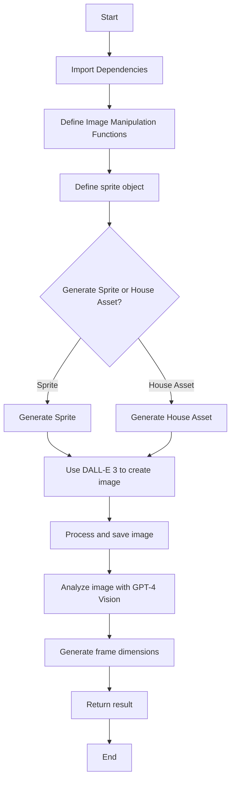

  ---
# High Level Context
## context
**Last Updated at:** 12/10/2024, 10:16:26 PM

Overview of index.js:

This code file contains functionality for generating and manipulating sprite images for use in game development, particularly with Phaser.js. The main components include:

1. Image manipulation functions (removeBackgroundColor, encodeImage, getUniqueColors)
2. A sprite object with methods for generating sprite sheets and house assets using OpenAI's DALL-E 3 model
3. Integration with OpenAI's GPT-4 Vision model to analyze generated images and determine appropriate frame dimensions

Mermaid Diagram:



The diagram shows the general flow of the code, starting with importing dependencies and defining functions, then moving on to the main sprite generation process. The code allows for either sprite or house asset generation, both using DALL-E 3. After image creation, the code processes the image and uses GPT-4 Vision to analyze it for appropriate frame dimensions. The final result is then returned.


---
# removeBackgroundColor /index.js
## Imported Code Object
**Last Updated at:** 12/11/2024, 4:29:07 PM

The `removeBackgroundColor` function in this code snippet is an asynchronous function that uses the Jimp library to remove a specified background color from an image. It scans each pixel of the input image, compares it to the target color (within a given threshold), and sets matching pixels to transparent before saving the modified image to the output path.

### Third Party libaries

Yes, this code uses a third-party library called Jimp (JavaScript Image Manipulation Program). Jimp is a popular image processing library for Node.js that allows you to read, manipulate, and write images in various formats.

In the code, you can see several Jimp-specific functions and methods being used:

1. `Jimp.read()`: To read the input image file.
2. `Jimp.cssColorToHex()`: To convert CSS color format to hexadecimal.
3. `image.scan()`: To iterate over each pixel of the image.
4. `Jimp.rgbaToInt()`: To convert RGBA values to a single integer representation.
5. `Jimp.colorDiff()`: To calculate the difference between two colors.
6. `Jimp.intToRGBA()`: To convert a color integer back to RGBA format.
7. `image.writeAsync()`: To save the modified image to a file.

These functions are not part of standard JavaScript or Node.js, but are provided by the Jimp library. To use this code, you would need to install Jimp in your project using npm or yarn, and import it at the top of your file like this:

```javascript
const Jimp = require('jimp');
```

or using ES6 import syntax:

```javascript
import Jimp from 'jimp';
```

So, in summary, yes, this code relies on the third-party Jimp library for image processing functionality.


---
# image.scan() callback /index.js
## Imported Code Object
**Last Updated at:** 12/11/2024, 4:29:19 PM

The `image.scan()` method in Jimp iterates over each pixel of the image, and the callback function is executed for each pixel, providing the x and y coordinates and an index (idx) to access the pixel data in the bitmap array. This allows for pixel-by-pixel manipulation of the image, where in this specific code snippet, it's being used to compare each pixel's color to a target color and make pixels transparent if they're within a certain color threshold.

### Third Party libaries

Yes, this code is using a third-party library called Jimp (JavaScript Image Manipulation Program). Jimp is a popular image processing library for Node.js that allows you to read, manipulate, and write images in various formats.

In the provided code snippet:

1. `image.scan()` is a method provided by Jimp to iterate over each pixel in the image.

2. `Jimp.rgbaToInt()` and `Jimp.intToRGBA()` are utility functions from Jimp for color conversions.

3. `Jimp.colorDiff()` is another Jimp function used to calculate the difference between two colors.

4. The `this.bitmap.data` array is part of Jimp's internal representation of the image data.

To use this code, you would need to have Jimp installed in your project (typically via npm) and properly imported at the top of your file, like this:

```javascript
const Jimp = require('jimp');
```

or using ES6 import syntax:

```javascript
import Jimp from 'jimp';
```

So, in summary, this code is heavily reliant on the Jimp library for image processing tasks.


---
# encodeImage /index.js
## Imported Code Object
**Last Updated at:** 12/11/2024, 4:29:30 PM

The `encodeImage` function reads an image file from the given path using `fs.readFileSync`, then converts it to a base64-encoded string using `Buffer.from(image).toString('base64')`, which is commonly used for embedding images directly in HTML or sending them as part of JSON data.

### Third Party libaries

No, this code does not use any third-party library. It uses only built-in Node.js modules:

1. `fs` (File System): This is a core Node.js module used for interacting with the file system. In this code, it's used to read the image file synchronously.

2. `Buffer`: This is also a built-in Node.js global object. It's used to work with binary data directly.

Here's a breakdown of what the code does:

1. `fs.readFileSync(imagePath)`: This reads the entire contents of the file specified by `imagePath` synchronously and returns it as a buffer.

2. `Buffer.from(image)`: This creates a new Buffer object from the image data.

3. `.toString('base64')`: This converts the buffer to a base64-encoded string.

So, this function reads an image file from the specified path and returns its contents as a base64-encoded string, all using standard Node.js functionality without any external dependencies.


---
# getUniqueColors /index.js
## Imported Code Object
**Last Updated at:** 12/11/2024, 4:29:41 PM

The `getUniqueColors` function in index.js is an asynchronous function that reads an image file, scans through its pixels, and returns an array of unique colors found in the image. It uses the Jimp library to process the image and a Set to efficiently store unique color values, ignoring fully transparent pixels.

### Third Party libaries

Yes, this code uses a third-party library called Jimp (JavaScript Image Manipulation Program). Jimp is a popular image processing library for Node.js that allows you to read, manipulate, and write images.

In the provided code:

1. `Jimp.read(imagePath)` is used to read the image file.
2. `Jimp.rgbaToInt()` is used to convert RGBA values to an integer representation of the color.
3. The `image.scan()` method, which is part of Jimp, is used to iterate over all pixels in the image.

These are all features provided by the Jimp library, which is not part of standard JavaScript or Node.js. To use this code, you would need to install Jimp in your project, typically via npm:

```
npm install jimp
```

And then import it at the top of your file:

```javascript
const Jimp = require('jimp');
```

or if using ES modules:

```javascript
import Jimp from 'jimp';
```

So, in summary, yes, this code relies on the third-party Jimp library for image processing functionality.


---
# generateHouseAsset /index.js
## Imported Code Object
**Last Updated at:** 12/11/2024, 4:29:53 PM

The `generateHouseAsset` function is an asynchronous method that uses OpenAI's DALL-E 3 model to generate 2D game assets based on a given description, with options for multiple iterations or a single image generation. It returns either an array of image responses (if iterations are specified) or a single image response, utilizing the DALL-E 3 API to create visual assets suitable for use in a Phaser JS game.

### Third Party libaries

Yes, this code appears to use a third-party library. Specifically, it's using the OpenAI API, which is a third-party service for generating images using AI models like DALL-E 3.

Here are the key indicators:

1. The `openAiObject` variable, which is likely an instance of the OpenAI API client.

2. The use of `dalle3.generate()` method, which is part of the OpenAI API for image generation.

3. The `model: "dall-e-3"` parameter, which specifies the use of the DALL-E 3 model from OpenAI.

4. Other parameters like `prompt`, `n`, and `size` are consistent with the OpenAI image generation API.

To use this code, you would need to have the OpenAI library installed in your project and properly configured with your API key. The OpenAI library is not a built-in part of JavaScript or Node.js, so it's definitely a third-party dependency.


---
# generateSprite /index.js
## Imported Code Object
**Last Updated at:** 12/11/2024, 4:30:06 PM

The `generateSprite` function in this code snippet is an asynchronous method that uses OpenAI's DALL-E 3 to generate sprite images based on a given description, and then uses GPT-4 Vision to analyze the generated image for optimal frame dimensions. It can optionally save the image, convert it to grayscale, and run multiple iterations, returning the generated image(s) along with frame size recommendations in JSON format.

### Third Party libaries

Yes, this code uses several third-party libraries:

1. OpenAI: The code uses the OpenAI library to interact with OpenAI's API for generating images (DALL-E 3) and text completions (GPT-4 Vision and GPT-3.5 Turbo).

2. Axios: The code uses Axios to make HTTP requests, specifically to download the generated image from the URL provided by DALL-E.

3. Sharp: The Sharp library is used for image processing tasks, such as converting the image to grayscale and saving it as a PNG file.

4. Path: While not a third-party library (it's a Node.js built-in module), the code uses the 'path' module to handle file paths.

5. Buffer: Also a Node.js built-in module, used for handling binary data.

These libraries are essential for the functionality of the code, allowing it to generate images, process them, and interact with AI models for various tasks related to sprite generation and analysis.

---
# sprite.generateSprite index.js
## Imported Code Object
The `sprite.generateSprite` function in this code snippet is an asynchronous method that generates a sprite image and its associated frame dimensions using AI services. Here's a concise explanation of its main functionalities:

1. It uses DALL-E 3 to generate a 6-frame sprite sheet based on a given description.
2. The generated image is processed (converted to grayscale) and optionally saved.
3. It then uses GPT-4 Vision to analyze the generated image and determine appropriate frame dimensions for use in Phaser.js.
4. Finally, it uses GPT-3.5 to format the frame dimensions into a JSON object.

The function can operate in two modes:
- Single generation: Returns a single sprite image and its frame dimensions.
- Multiple iterations: Generates multiple sprite images and frame dimensions when the `iterations` option is specified.

The result includes the generated image(s) as a data URL and the suggested frame dimensions in JSON format.

### Third Party libaries

Yes, this code does use several third-party libraries. Here are the main ones:

1. OpenAI: The code uses the OpenAI API to generate images with DALL-E 3 and to make chat completions with GPT-4 Vision and GPT-3.5 Turbo.

2. axios: This is used to make HTTP requests, specifically to download the image generated by DALL-E.

3. sharp: This image processing library is used to manipulate the downloaded image (converting to grayscale, ensuring alpha channel, etc.).

4. path: While this is a built-in Node.js module, it's used here for file path operations.

5. Buffer: This is a built-in Node.js class used for handling binary data.

Additionally, the code seems to be part of a larger system or framework, possibly using:

6. Phaser: While not directly used in this code snippet, the comments reference Phaser.js, a game framework for HTML5.

The main functionalities that rely on third-party libraries are:

- Image generation (OpenAI's DALL-E 3)
- Image analysis (OpenAI's GPT-4 Vision)
- Text generation and parsing (OpenAI's GPT-3.5 Turbo)
- HTTP requests (axios)
- Image processing (sharp)

These libraries significantly extend the capabilities of the code beyond what's available in standard JavaScript or Node.js.

  
---
# removeBackgroundColor index.js
## Imported Code Object
The `removeBackgroundColor` function in this code snippet is designed to remove a specified background color from an image. Here's a concise explanation of its functionality:

1. It takes an input image, a target color to remove, and a color threshold as parameters.
2. It uses the Jimp library to read and process the image.
3. The function scans through each pixel of the image.
4. For each pixel, it compares its color to the target color.
5. If the difference between the pixel color and the target color is within the specified threshold, it makes that pixel transparent by setting its alpha value to 0.
6. Finally, it saves the processed image with the background color removed to the specified output path.

In essence, this function allows you to remove a specific background color from an image, creating transparency where that color was present.

### Third Party libaries

Yes, this code does use a third-party library. It uses the Jimp library, which is a JavaScript image processing library.

Here are the key indicators that Jimp is being used:

1. `Jimp.read(inputPath)`: This is used to read the input image file.

2. `Jimp.cssColorToHex(targetColor)`: This converts a CSS color string to a hexadecimal color value.

3. `Jimp.rgbaToInt(red, green, blue, 255)`: This converts RGBA color values to an integer representation.

4. `Jimp.colorDiff()`: This calculates the difference between two colors.

5. `Jimp.intToRGBA()`: This converts an integer color representation back to RGBA values.

6. `image.scan()`: This method is used to iterate over all pixels in the image.

7. `image.writeAsync(outputPath)`: This is used to save the processed image to a file.

Jimp is a popular image processing library for JavaScript that provides various methods for reading, manipulating, and writing images. It's commonly used in Node.js applications for server-side image processing tasks.

  