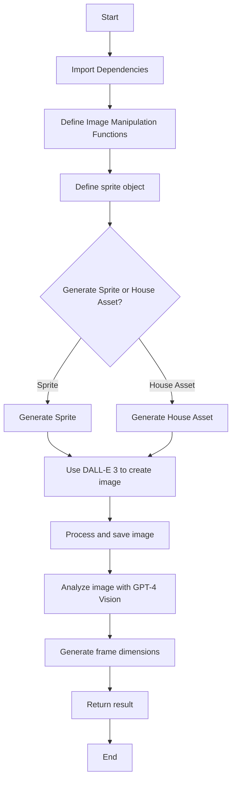

---
# High Level Context
## context
**Last Updated at:** 12/10/2024, 10:16:26 PM

Overview of index.js:

This code file contains functionality for generating and manipulating sprite images for use in game development, particularly with Phaser.js. The main components include:

1. Image manipulation functions (removeBackgroundColor, encodeImage, getUniqueColors)
2. A sprite object with methods for generating sprite sheets and house assets using OpenAI's DALL-E 3 model
3. Integration with OpenAI's GPT-4 Vision model to analyze generated images and determine appropriate frame dimensions

Mermaid Diagram:



The diagram shows the general flow of the code, starting with importing dependencies and defining functions, then moving on to the main sprite generation process. The code allows for either sprite or house asset generation, both using DALL-E 3. After image creation, the code processes the image and uses GPT-4 Vision to analyze it for appropriate frame dimensions. The final result is then returned.

---

# removeBackgroundColor /index.js
## Imported Code Object
**Last Updated at:** 12/11/2024, 4:29:07 PM

The `removeBackgroundColor` function in this code snippet is an asynchronous function that uses the Jimp library to remove a specified background color from an image. It scans each pixel of the input image, compares it to the target color (within a given threshold), and sets matching pixels to transparent before saving the modified image to the output path.

### Third Party libaries

Yes, this code uses a third-party library called Jimp (JavaScript Image Manipulation Program). Jimp is a popular image processing library for Node.js that allows you to read, manipulate, and write images in various formats.

In the code, you can see several Jimp-specific functions and methods being used:

1. `Jimp.read()`: To read the input image file.
2. `Jimp.cssColorToHex()`: To convert CSS color format to hexadecimal.
3. `image.scan()`: To iterate over each pixel of the image.
4. `Jimp.rgbaToInt()`: To convert RGBA values to a single integer representation.
5. `Jimp.colorDiff()`: To calculate the difference between two colors.
6. `Jimp.intToRGBA()`: To convert a color integer back to RGBA format.
7. `image.writeAsync()`: To save the modified image to a file.

These functions are not part of standard JavaScript or Node.js, but are provided by the Jimp library. To use this code, you would need to install Jimp in your project using npm or yarn, and import it at the top of your file like this:

```javascript
const Jimp = require('jimp');
```

or using ES6 import syntax:

```javascript
import Jimp from 'jimp';
```

So, in summary, yes, this code relies on the third-party Jimp library for image processing functionality.

# encodeImage /index.js
## Imported Code Object
**Last Updated at:** 12/11/2024, 4:29:30 PM

The `encodeImage` function reads an image file from the given path using `fs.readFileSync`, then converts it to a base64-encoded string using `Buffer.from(image).toString('base64')`, which is commonly used for embedding images directly in HTML or sending them as part of JSON data.

### Third Party libaries

No, this code does not use any third-party library. It uses only built-in Node.js modules:

1. `fs` (File System): This is a core Node.js module used for interacting with the file system. In this code, it's used to read the image file synchronously.

2. `Buffer`: This is also a built-in Node.js global object. It's used to work with binary data directly.

Here's a breakdown of what the code does:

1. `fs.readFileSync(imagePath)`: This reads the entire contents of the file specified by `imagePath` synchronously and returns it as a buffer.

2. `Buffer.from(image)`: This creates a new Buffer object from the image data.

3. `.toString('base64')`: This converts the buffer to a base64-encoded string.

So, this function reads an image file from the specified path and returns its contents as a base64-encoded string, all using standard Node.js functionality without any external dependencies.

# getUniqueColors /index.js
## Imported Code Object
**Last Updated at:** 12/11/2024, 4:29:41 PM

The `getUniqueColors` function in index.js is an asynchronous function that reads an image file, scans through its pixels, and returns an array of unique colors found in the image. It uses the Jimp library to process the image and a Set to efficiently store unique color values, ignoring fully transparent pixels.

### Third Party libaries

Yes, this code uses a third-party library called Jimp (JavaScript Image Manipulation Program). Jimp is a popular image processing library for Node.js that allows you to read, manipulate, and write images.

In the provided code:

1. `Jimp.read(imagePath)` is used to read the image file.
2. `Jimp.rgbaToInt()` is used to convert RGBA values to an integer representation of the color.
3. The `image.scan()` method, which is part of Jimp, is used to iterate over all pixels in the image.

These are all features provided by the Jimp library, which is not part of standard JavaScript or Node.js. To use this code, you would need to install Jimp in your project, typically via npm:

```
npm install jimp
```

And then import it at the top of your file:

```javascript
const Jimp = require('jimp');
```

or if using ES modules:

```javascript
import Jimp from 'jimp';
```

So, in summary, yes, this code relies on the third-party Jimp library for image processing functionality.

# sprite /index.js
## Imported Code Object
**Last Updated at:** 12/10/2024, 9:57:07 PM

The `sprite/index.js` file exports an object named `sprite` containing two asynchronous methods: `generateSprite` and `generateHouseAsset`. These methods use OpenAI's DALL-E 3 and GPT models to generate and analyze sprite images based on text descriptions, with options for multiple iterations and image saving.

### Third Party libaries

Yes, this code uses several third-party libraries:

1. OpenAI: The code uses the OpenAI API to generate images and process text. This is evident from the use of `new OpenAI()` and calls to various OpenAI models like "dall-e-3", "gpt-4-vision-preview", and "gpt-3.5-turbo-1106".

2. Axios: The code uses Axios to make HTTP requests, specifically to download images. This is seen in the line `const res = await axios.get(response.data[0].url, { responseType: 'arraybuffer' });`.

3. Sharp: This image processing library is used to manipulate images, such as converting them to grayscale and saving them. Examples include `await sharp(imgBuffer).ensureAlpha().greyscale().toFile(pictureFilename)` and `let grayImageBuffer = await sharp(imgBuffer).ensureAlpha().greyscale().toBuffer()`.

4. Node.js built-in modules:
   - `path`: Used for handling file paths.
   - `Buffer`: Used for working with binary data.

5. While not explicitly imported in this snippet, the code assumes the presence of a global `OpenAI` object, which is likely from the OpenAI Node.js library.

These libraries are not standard JavaScript and would need to be installed (typically via npm) and imported into the project to use this code.

---

# generateSprite /index.js
## Imported Code Object
**Last Updated at:** 12/11/2024, 4:30:06 PM

The `generateSprite` function in this code snippet is an asynchronous method that uses OpenAI's DALL-E 3 to generate sprite images based on a given description, and then uses GPT-4 Vision to analyze the generated image for optimal frame dimensions. It can optionally save the image, convert it to grayscale, and run multiple iterations, returning the generated image(s) along with frame size recommendations in JSON format.

### Third Party libaries

Yes, this code uses several third-party libraries:

1. OpenAI: The code uses the OpenAI library to interact with OpenAI's API for generating images (DALL-E 3) and text completions (GPT-4 Vision and GPT-3.5 Turbo).

2. Axios: The code uses Axios to make HTTP requests, specifically to download the generated image from the URL provided by DALL-E.

3. Sharp: The Sharp library is used for image processing tasks, such as converting the image to grayscale and saving it as a PNG file.

4. Path: While not a third-party library (it's a Node.js built-in module), the code uses the 'path' module to handle file paths.

5. Buffer: Also a Node.js built-in module, used for handling binary data.

These libraries are essential for the functionality of the code, allowing it to generate images, process them, and interact with AI models for various tasks related to sprite generation and analysis.

# generateHouseAsset /index.js
## Imported Code Object
**Last Updated at:** 12/11/2024, 4:29:53 PM

The `generateHouseAsset` function is an asynchronous method that uses OpenAI's DALL-E 3 model to generate 2D game assets based on a given description, with options for multiple iterations or a single image generation. It returns either an array of image responses (if iterations are specified) or a single image response, utilizing the DALL-E 3 API to create visual assets suitable for use in a Phaser JS game.

### Third Party libaries

Yes, this code appears to use a third-party library. Specifically, it's using the OpenAI API, which is a third-party service for generating images using AI models like DALL-E 3.

Here are the key indicators:

1. The `openAiObject` variable, which is likely an instance of the OpenAI API client.

2. The use of `dalle3.generate()` method, which is part of the OpenAI API for image generation.

3. The `model: "dall-e-3"` parameter, which specifies the use of the DALL-E 3 model from OpenAI.

4. Other parameters like `prompt`, `n`, and `size` are consistent with the OpenAI image generation API.

To use this code, you would need to have the OpenAI library installed in your project and properly configured with your API key. The OpenAI library is not a built-in part of JavaScript or Node.js, so it's definitely a third-party dependency.

# colorToReplace /index.js
## Imported Code Object
**Last Updated at:** 12/10/2024, 9:53:52 PM

In this code snippet, `colorToReplace` is a variable that stores the hexadecimal color value obtained by converting a CSS color string (like '#FFFFFF') to its corresponding hex value using the `Jimp.cssColorToHex()` method. This conversion is necessary because Jimp typically works with hexadecimal color values internally for image processing operations.

### Third Party libaries

Yes, this code does use a third-party library. The `Jimp` object being used in this line of code is from the Jimp library, which is a popular image processing library for JavaScript.

Jimp (JavaScript Image Manipulation Program) is an image processing library for Node.js that can read, write, and manipulate images in various formats. It's commonly used for tasks like resizing, cropping, color manipulation, and more.

In this specific line:

```javascript
const colorToReplace = Jimp.cssColorToHex(targetColor);
```

The `Jimp.cssColorToHex()` method is being used to convert a CSS color string (like '#FFFFFF') to its hexadecimal representation, which is likely used for further image processing operations.

To use Jimp in a project, you would typically install it via npm:

```
npm install jimp
```

And then import it in your JavaScript file:

```javascript
const Jimp = require('jimp');
```

So, in summary, yes, this code is using the third-party Jimp library for image processing functionality.

---

# image /index.js
## Imported Code Object
**Last Updated at:** 12/10/2024, 9:59:37 PM

In the given code snippet, `image: imageDataUrl` is likely referencing a data URL representation of an image, which is a string containing the image data encoded in base64 format. This allows the image to be directly embedded in the JSON response or stored in memory without requiring a separate file, making it convenient for web applications to handle and display images dynamically.

### Third Party libaries

Based on the code snippet you've provided:

```javascript
iterations.push({messages: jsonFrameResponse.choices[0].message, image: imageDataUrl})
```

This code doesn't directly use a third-party library. However, it does suggest that some external APIs or libraries might be in use in the broader context of the application:

1. The `jsonFrameResponse` object seems to have a structure similar to what you might get from an AI API response, possibly from OpenAI's GPT or a similar service.

2. The `imageDataUrl` suggests that there's some image processing or handling going on, possibly using built-in browser APIs or a separate image processing library.

3. The `iterations` array is being used to store objects containing message and image data, which is standard JavaScript.

While this specific line doesn't use a third-party library, the full context of the application likely involves external services or libraries for AI interactions and possibly image handling. To definitively say whether third-party libraries are used, we'd need to see more of the codebase, particularly the parts where `jsonFrameResponse` and `imageDataUrl` are defined and processed.

---

# image.scan() callback /index.js
## Imported Code Object
**Last Updated at:** 12/11/2024, 4:29:19 PM

The `image.scan()` method in Jimp iterates over each pixel of the image, and the callback function is executed for each pixel, providing the x and y coordinates and an index (idx) to access the pixel data in the bitmap array. This allows for pixel-by-pixel manipulation of the image, where in this specific code snippet, it's being used to compare each pixel's color to a target color and make pixels transparent if they're within a certain color threshold.

### Third Party libaries

Yes, this code is using a third-party library called Jimp (JavaScript Image Manipulation Program). Jimp is a popular image processing library for Node.js that allows you to read, manipulate, and write images in various formats.

In the provided code snippet:

1. `image.scan()` is a method provided by Jimp to iterate over each pixel in the image.

2. `Jimp.rgbaToInt()` and `Jimp.intToRGBA()` are utility functions from Jimp for color conversions.

3. `Jimp.colorDiff()` is another Jimp function used to calculate the difference between two colors.

4. The `this.bitmap.data` array is part of Jimp's internal representation of the image data.

To use this code, you would need to have Jimp installed in your project (typically via npm) and properly imported at the top of your file, like this:

```javascript
const Jimp = require('jimp');
```

or using ES6 import syntax:

```javascript
import Jimp from 'jimp';
```

So, in summary, this code is heavily reliant on the Jimp library for image processing tasks.

---

# blue /index.js
## Imported Code Object
**Last Updated at:** 12/10/2024, 9:54:29 PM

In the code snippet `const blue = this.bitmap.data[idx + 2];`, `blue` represents the blue color component of a pixel in an image, typically stored as the third value (index 2) in a 4-element array representing RGBA values. This is commonly used when working with image processing libraries, where `this.bitmap.data` is an array containing all pixel color information, and `idx` is the starting index for the current pixel being processed.

### Third Party libaries

The code snippet you provided:

```javascript
const blue = this.bitmap.data[idx + 2];
```

does not directly use a third-party library. This line of code is accessing the blue component of a pixel in an image bitmap.

However, this code is likely part of a larger context or class that might be using an image processing library. The presence of `this.bitmap` suggests that it's probably within a method of an object or class that deals with image manipulation.

Common image processing libraries in JavaScript that use similar syntax include:

1. Jimp (JavaScript Image Manipulation Program)
2. Sharp
3. Canvas API (built into browsers, not strictly a third-party library)

Without more context about where this code is situated and what other parts of the codebase look like, it's not possible to definitively say whether a third-party library is being used. The line itself is standard JavaScript accessing an array-like structure, but the overall functionality it's part of may well be provided by a library.


---
# colorDiff /index.js
## Imported Code Object
**Last Updated at:** 12/10/2024, 9:54:40 PM

`Jimp.colorDiff` is a method provided by the Jimp library that calculates the color difference between two colors, represented as RGB objects. In this code snippet, it's comparing the color specified by `{ r: red, g: green, b: blue }` with the color obtained from `Jimp.intToRGBA(colorToReplace)`, likely to determine how similar or different these colors are.

### Third Party libaries

Yes, this code does use a third-party library. It's using the Jimp library, which is a JavaScript image processing library.

In the code snippet you provided:

```javascript
const colorDiff = Jimp.colorDiff({ r: red, g: green, b: blue }, Jimp.intToRGBA(colorToReplace));
```

The `Jimp` object is being used, which is not a part of standard JavaScript. It's coming from the Jimp library. Specifically:

1. `Jimp.colorDiff()` is a method provided by Jimp to calculate the difference between two colors.

2. `Jimp.intToRGBA()` is another method from Jimp that converts an integer color representation to an RGBA object.

To use this code, you would need to have Jimp installed in your project and properly imported at the top of your file, typically like this:

```javascript
const Jimp = require('jimp');
```

or in ES6 syntax:

```javascript
import Jimp from 'jimp';
```

So, in summary, yes, this code is using the third-party Jimp library for image processing tasks.


---
# b /index.js
## Imported Code Object
**Last Updated at:** 12/10/2024, 9:54:50 PM

In the given code snippet, `b` represents the blue component of the RGB color being compared, and `/index.js` is not part of this code; it's likely a file path mentioned elsewhere. The `colorDiff` function from the Jimp library is comparing two colors: one specified by separate red, green, and blue values, and another color obtained by converting `colorToReplace` to RGB format.

### Third Party libaries

Yes, this code uses a third-party library. The library being used is Jimp (JavaScript Image Manipulation Program).

Jimp is a popular image processing library for Node.js that allows you to read, manipulate, and write images. In this specific line of code:

```javascript
const colorDiff = Jimp.colorDiff({ r: red, g: green, b: blue }, Jimp.intToRGBA(colorToReplace));
```

Two Jimp methods are being used:

1. `Jimp.colorDiff()`: This method calculates the difference between two colors.
2. `Jimp.intToRGBA()`: This method converts an integer color value to an RGBA object.

To use Jimp in your project, you would typically need to install it via npm:

```
npm install jimp
```

And then import it in your JavaScript file:

```javascript
const Jimp = require('jimp');
```

So, to answer your question directly: yes, this code is using the third-party Jimp library for image processing tasks.


---
# g /index.js
## Imported Code Object
**Last Updated at:** 12/10/2024, 9:55:00 PM

In the code snippet `Jimp.colorDiff({ r: red, g: green, b: blue }, Jimp.intToRGBA(colorToReplace))`, `g` refers to the green component of the RGB color space. It's part of an object that represents a color, where `r`, `g`, and `b` stand for red, green, and blue values respectively.

### Third Party libaries

Yes, this code does use a third-party library. The library being used is Jimp (JavaScript Image Manipulation Program).

Jimp is a popular image processing library for Node.js that allows you to read and manipulate images in pure JavaScript. In this specific line of code:

```javascript
const colorDiff = Jimp.colorDiff({ r: red, g: green, b: blue }, Jimp.intToRGBA(colorToReplace));
```

Two Jimp methods are being used:

1. `Jimp.colorDiff()`: This method calculates the difference between two colors.
2. `Jimp.intToRGBA()`: This method converts an integer color value to an RGBA object.

To use Jimp in your project, you would typically need to install it via npm:

```
npm install jimp
```

And then import it in your JavaScript file:

```javascript
const Jimp = require('jimp');
```

So, in summary, yes, this code is using the third-party Jimp library for image color manipulation.


---
# r /index.js
## Imported Code Object
**Last Updated at:** 12/10/2024, 9:55:11 PM

In the code snippet `const colorDiff = Jimp.colorDiff({ r: red, g: green, b: blue }, Jimp.intToRGBA(colorToReplace));`, `r` is likely a property accessor for the red channel value in an RGB color representation. It's used to specify or access the red component of a color, typically with values ranging from 0 to 255.

### Third Party libaries

Yes, this code does use a third-party library. It's using the Jimp library, which is a JavaScript image processing library.

Jimp (JavaScript Image Manipulation Program) is a popular image processing library for Node.js and browsers. It allows you to read and write many image formats and perform various image manipulation tasks.

In the code snippet you provided:

1. `Jimp.colorDiff()` is a method provided by the Jimp library to calculate the difference between two colors.

2. `Jimp.intToRGBA()` is another method from Jimp that converts an integer color representation to an RGBA object.

To use this code, you would need to have Jimp installed in your project (typically via npm or yarn) and imported at the top of your file, like this:

```javascript
const Jimp = require('jimp');
```

or using ES6 import syntax:

```javascript
import Jimp from 'jimp';
```

So, in summary, yes, this code is using the third-party Jimp library for image processing tasks.


---
# currentColor /index.js
## Imported Code Object
**Last Updated at:** 12/10/2024, 9:55:24 PM

In this code snippet, `currentColor` is a variable that stores the result of converting RGB color values (red, green, blue) and an alpha value (255 for full opacity) into a single integer representation using Jimp's `rgbaToInt` method. This integer representation can be used efficiently in image processing operations within the Jimp library.

### Third Party libaries

Yes, this code snippet does use a third-party library. The `Jimp` object being referenced is from the Jimp library, which is a popular image processing library for JavaScript.

Jimp (JavaScript Image Manipulation Program) is an image processing library for Node.js and the browser that's written entirely in JavaScript, with no native dependencies. It allows you to read and write images in various formats and perform operations like resizing, cropping, color manipulation, and more.

In this specific line of code:

```javascript
const currentColor = Jimp.rgbaToInt(red, green, blue, 255);
```

The `Jimp.rgbaToInt()` method is being used to convert RGB color values (and an alpha value) into a single integer representation of the color. This is a utility function provided by the Jimp library.

To use this code, you would need to have Jimp installed in your project (typically via npm) and imported at the top of your file, like this:

```javascript
const Jimp = require('jimp');
```

or in ES6 syntax:

```javascript
import Jimp from 'jimp';
```

So, to answer your question directly: yes, this code is using the third-party Jimp library.


---
# green /index.js
## Imported Code Object
**Last Updated at:** 12/10/2024, 9:55:36 PM

In the code snippet `const green = this.bitmap.data[idx + 1];`, `green` represents the green channel value of a pixel in an image, where `this.bitmap.data` is likely an array or buffer containing pixel data, and `idx + 1` is the index for the green component (assuming RGBA format where R=idx, G=idx+1, B=idx+2, A=idx+3). This line extracts the green intensity value for a specific pixel in the image.

### Third Party libaries

No, this code does not use a third-party library. 

The line `const green = this.bitmap.data[idx + 1];` is likely part of a larger image processing or manipulation context. It's accessing the green color channel of a pixel in an image bitmap.

Here's a breakdown:

1. `this.bitmap.data` is probably an array or typed array containing pixel data.
2. `idx` is likely an index pointing to a specific pixel.
3. `+ 1` is used because in most bitmap formats, the color channels are stored in the order: Red, Green, Blue, (Alpha). So, the green channel is at index + 1.

This code is using standard JavaScript syntax and is likely working with a bitmap that's part of the object's own properties (hence the `this`). It's not calling any external library functions in this specific line.

However, it's worth noting that the larger context of where this code is used might involve image processing libraries or frameworks. But this particular line itself is not directly using any third-party library.


---
# red /index.js
## Imported Code Object
**Last Updated at:** 12/10/2024, 9:55:47 PM

In the code snippet `const red = this.bitmap.data[idx + 0];`, `red` represents the red color channel value of a pixel in an image. The `this.bitmap.data` array typically stores pixel data in RGBA format, where the red value is at index 0 for each pixel, followed by green (1), blue (2), and alpha (3).

### Third Party libaries

The code snippet you provided:

```javascript
const red = this.bitmap.data[idx + 0];
```

does not directly use a third-party library. This line of code is accessing a property of an object that is part of the current context (indicated by `this`).

However, it's important to note:

1. This code is likely part of a larger image processing or manipulation library or application.

2. The `this.bitmap` object seems to be representing image data, where each pixel's color information is stored in an array-like structure.

3. While this specific line doesn't use a third-party library, the overall context or the library in which this code exists might be using or be part of a third-party image processing library like Jimp, Sharp, or a custom implementation.

4. The structure (using `bitmap.data` to access pixel data) is common in many image processing libraries and APIs, including the HTML5 Canvas API.

To definitively determine if a third-party library is being used, you would need to look at the broader context of the code, including import statements, the overall structure of the application or module, and any documentation or comments provided with the code.


---
# result /index.js
## Imported Code Object
**Last Updated at:** 12/10/2024, 9:56:00 PM

In this code snippet, `result` is likely to be undefined or null, as the `writeAsync` method typically doesn't return a meaningful value. The purpose of this line is to asynchronously write the image to the specified `outputPath`, and the `await` keyword ensures that the operation completes before moving to the next line of code.

### Third Party libaries

Yes, this code appears to be using a third-party library. The `image.writeAsync()` method is not a native JavaScript or Node.js function. It's likely coming from an image processing library.

Based on the syntax and the context provided, this code is most likely using the `jimp` library (short for JavaScript Image Manipulation Program). Jimp is a popular image processing library for Node.js that allows for reading, writing, and manipulating images.

In Jimp, the `writeAsync()` method is used to save an image to a file asynchronously. The usage you've shown is consistent with how Jimp is typically used:

```javascript
let result = await image.writeAsync(outputPath);
```

Here, `image` would be a Jimp image object, and `outputPath` would be the file path where you want to save the image.

If this is indeed using Jimp, you would typically see it imported at the top of your file like this:

```javascript
const Jimp = require('jimp');
```

or in ES6 syntax:

```javascript
import Jimp from 'jimp';
```

Remember, without seeing the full context of your code or the imports at the top of the file, I can't be 100% certain it's Jimp, but based on the syntax, it's a very likely possibility.


---
# colorSet /index.js
## Imported Code Object
**Last Updated at:** 12/10/2024, 9:56:30 PM

In the code snippet `const colorSet = new Set();`, `colorSet` is a new Set object being created, which is a built-in JavaScript data structure that stores unique values of any type. Sets are useful for managing collections of unique items, eliminating duplicates automatically, and performing efficient membership tests.

### Third Party libaries

No, the code snippet `const colorSet = new Set();` does not use any third-party library. This is using the built-in `Set` object, which is part of standard JavaScript (ECMAScript 6 and later).

The `Set` object is a native JavaScript data structure that lets you store unique values of any type, whether primitive values or object references. It's part of the JavaScript language itself and doesn't require any additional libraries or imports.

Here's a brief overview of what this line does:

1. `new Set()` creates a new Set object.
2. `const colorSet` declares a constant variable named `colorSet` and assigns the newly created Set to it.

You can use this `Set` object to store unique colors or any other values, and it provides methods like `add()`, `delete()`, `has()`, and `clear()` to manipulate the set of values.


---
# alpha /index.js
## Imported Code Object
**Last Updated at:** 12/10/2024, 9:56:42 PM

In the code snippet `const alpha = this.bitmap.data[idx + 3];`, `alpha` represents the alpha (transparency) value of a pixel in an image, where `this.bitmap.data` is likely an array containing RGBA values for each pixel, and `idx + 3` accesses the alpha component (the fourth value) of a specific pixel. Here's a simplified example:

```javascript
// Assuming bitmap.data is an array of RGBA values for each pixel
const imageData = [255, 0, 0, 255, 0, 255, 0, 128]; // Red pixel (fully opaque), Green pixel (semi-transparent)
const idx = 0; // Index for the first pixel
const alpha = imageData[idx + 3]; // alpha = 255 (fully opaque)
```

### Third Party libaries

The code snippet you provided:

```javascript
const alpha = this.bitmap.data[idx + 3];
```

does not directly use any third-party library. This line of code is accessing the alpha channel value from an image bitmap data array.

However, this code is likely part of a larger context or library that deals with image processing. The `this.bitmap.data` suggests that it's probably within a method of an object or class that represents an image.

Common image processing libraries in JavaScript that might use similar patterns include:

1. Jimp (JavaScript Image Manipulation Program)
2. Sharp
3. Canvas API (which is built into modern browsers)

But without more context about where this code is from or what `this` refers to, it's not possible to definitively say if it's part of a third-party library or custom code. The line itself is vanilla JavaScript accessing an array property.


---
# colorInt /index.js
## Imported Code Object
**Last Updated at:** 12/10/2024, 9:56:52 PM

In this code snippet, `colorInt` represents an integer value that encodes the RGBA color values (red, green, blue, and alpha) into a single 32-bit integer using Jimp's `rgbaToInt` method. This integer representation of color is commonly used in image processing libraries like Jimp for efficient storage and manipulation of pixel color data.

### Third Party libaries

Yes, this code does use a third-party library. The `Jimp` object in the code snippet is referring to the Jimp (JavaScript Image Manipulation Program) library.

Jimp is a popular image processing library for Node.js and browsers that allows you to read, manipulate, and write images. The `rgbaToInt` method is a utility function provided by Jimp to convert RGBA color values to a single integer representation.

To use this code, you would need to have Jimp installed in your project and properly imported. Typically, you would install it via npm:

```
npm install jimp
```

And then import it in your JavaScript file:

```javascript
import Jimp from 'jimp';
// or
const Jimp = require('jimp');
```

After that, you can use Jimp's methods like `rgbaToInt` as shown in your code snippet.


---
# dalle3 /index.js
## Imported Code Object
**Last Updated at:** 12/10/2024, 9:57:31 PM

The `dalle3` object in this code snippet is likely referring to the DALL-E 3 image generation capabilities provided by OpenAI's API, accessed through the `images` property of an OpenAI client object. It would be used to generate or manipulate images based on text prompts or other parameters, as shown in this example:

```javascript
const response = await openAiObject.images.generate({
  model: "dall-e-3",
  prompt: "A futuristic city skyline at sunset",
  n: 1,
  size: "1024x1024"
});
```

### Third Party libaries

The code snippet you've provided:

```javascript
const dalle3 = openAiObject.images
```

doesn't directly use a third-party library. However, it's accessing the `images` property of an `openAiObject`, which suggests that it's likely using the official OpenAI API client library.

The OpenAI API client is typically installed as a third-party package in Node.js projects. It's commonly installed via npm like this:

```
npm install openai
```

And then used in code like this:

```javascript
const OpenAI = require('openai');

const openai = new OpenAI({
  apiKey: process.env.OPENAI_API_KEY
});

const dalle3 = openai.images;
```

So while the specific line you've shown doesn't directly use a third-party library, it's very likely that the `openAiObject` was created using the OpenAI npm package, which would be considered a third-party library.

The `images` object (which is being assigned to `dalle3` in your code) is part of the OpenAI API client and provides methods for interacting with DALL-E 3, OpenAI's image generation model.


---
# i /index.js
## Imported Code Object
**Last Updated at:** 12/10/2024, 9:57:38 PM

The code snippet `let i = 0;` declares a variable named `i` and initializes it with the value 0. This is commonly used as a counter or index variable in loops or other situations where you need to keep track of a numeric value.

### Third Party libaries

The code snippet you provided:

```javascript
let i = 0;
```

does not use any third-party library. This is plain JavaScript code that declares a variable `i` and initializes it with the value 0.

This is a standard JavaScript declaration using the `let` keyword, which is part of the core JavaScript language (ECMAScript 6 and later). It doesn't require any external libraries or dependencies to work.


---
# iterations /index.js
## Imported Code Object
**Last Updated at:** 12/10/2024, 9:57:44 PM

In this code snippet, `iterations = []` initializes an empty array called `iterations`. This creates a new array that can be used to store elements, but it starts with no elements inside it.

### Third Party libaries

The code snippet you provided:

```javascript
let iterations = []
```

does not use any third-party library. This is a simple JavaScript statement that declares a variable named `iterations` and initializes it as an empty array.

This is pure JavaScript and doesn't require any external libraries or dependencies. It's a fundamental feature of the language that can be used in any JavaScript environment, whether it's in a browser, Node.js, or any other JavaScript runtime.


---
# response /index.js
## Imported Code Object
**Last Updated at:** 12/10/2024, 9:57:54 PM

The `response` variable likely contains the result of the DALL-E 3 image generation API call, which typically includes information about the generated image(s) such as URLs, metadata, and possibly the image data itself. To access the generated image, you would typically use something like `response.data[0].url` or a similar property, depending on the exact structure of the API response.

### Third Party libaries

Yes, this code appears to be using a third-party library. Specifically, it's using an API or SDK for DALL-E 3, which is OpenAI's image generation model.

The `dalle3.generate()` function is not a native JavaScript method, so it's likely coming from a library or SDK that provides an interface to interact with the DALL-E 3 API.

This could be:

1. The official OpenAI JavaScript library
2. A custom wrapper around the OpenAI API
3. Another third-party library that provides access to DALL-E 3

The structure of the function call (with options like `model`, `prompt`, `n`, and `size`) is consistent with how many AI image generation APIs are typically used.

So, in summary, yes, this code is using a third-party library to interact with the DALL-E 3 image generation service.


---
# model /index.js
## Imported Code Object
**Last Updated at:** 12/10/2024, 9:58:05 PM

The "model" parameter in this code snippet specifies which AI model to use for image generation, in this case, "dall-e-3" refers to OpenAI's DALL-E 3 model. This parameter is typically used when making API calls to OpenAI's image generation service, as shown in this example:

```javascript
const response = await openai.createImage({
  prompt: "A cute robot drawing a picture",
  model: "dall-e-3",
  n: 1,
  size: "1024x1024"
});
```

### Third Party libaries

The code snippet you've provided:

```javascript
model: "dall-e-3",
```

is not a complete piece of code, but rather appears to be a property assignment or object property. It's likely part of a larger configuration or options object.

This specific line doesn't directly use a third-party library. However, it suggests that the code is interacting with or configuring something related to DALL-E 3, which is an AI model developed by OpenAI for generating images from text descriptions.

If this is part of a larger codebase or application, it's likely that it's being used in conjunction with OpenAI's API or a library that interfaces with OpenAI's services. The OpenAI API would be considered a third-party service, and any library used to interact with it (like the official OpenAI Node.js library) would be a third-party library.

To definitively say whether this code uses a third-party library, we would need to see more of the surrounding code and context.


---
# n /index.js
## Imported Code Object
**Last Updated at:** 12/10/2024, 9:58:15 PM

In the code snippet `n: 1,`, `n` is likely a property name in an object literal, and `1` is its corresponding value. This syntax is commonly used in JavaScript objects, configuration files, or as part of a larger data structure.

### Third Party libaries

The code snippet you provided:

```javascript
n: 1,
```

is not complete enough to determine whether it uses a third-party library or not. This appears to be a property-value pair, likely part of an object literal or configuration object in JavaScript.

Without more context or the surrounding code, it's impossible to say definitively whether this is related to a third-party library or not. This could be:

1. Part of a configuration object for a third-party library
2. A property in a custom object in your own code
3. Part of a larger JavaScript structure unrelated to any library

To determine if a third-party library is being used, you would need to look at:

1. The full contents of the file
2. Any import or require statements at the top of the file
3. The package.json file (if it's a Node.js project) to see what dependencies are listed

If you can provide more of the code from the index.js file, I'd be happy to take a closer look and give you a more definitive answer.


---
# prompt /index.js
## Imported Code Object
**Last Updated at:** 12/10/2024, 9:58:24 PM

The `prompt` property in this code snippet is likely part of an object or configuration used to generate AI-based image content, where the string inside the backticks (`) is a template literal that includes a dynamic `${description}` value to customize the prompt for generating a 2D game asset. This prompt is designed to instruct an AI model to create an image suitable for use in a Phaser.js game based on the provided description.

### Third Party libaries

No, this code snippet does not use any third-party library. It's just a JavaScript string template literal that defines a prompt for generating a 2D asset. 

The backticks (`) are used to create a template literal in JavaScript, allowing for multi-line strings and the embedding of expressions using ${...} syntax. In this case, it's embedding a variable called `description` into the prompt string.

This could be part of a larger system that might use this prompt to generate images, possibly through an AI image generation service, but the snippet itself doesn't directly use any external libraries.


---
# size /index.js
## Imported Code Object
**Last Updated at:** 12/10/2024, 9:58:33 PM

The code snippet sets a default value for the "size" property, using the nullish coalescing operator (??) to check if a size is provided in the options object, and if not, it defaults to "1024x1024". This allows for flexible configuration where the size can be customized if specified, but falls back to a standard size if not provided.

### Third Party libaries

The code snippet you provided:

```javascript
size: options?.size || "1024x1024",
```

does not directly use any third-party library. This is standard JavaScript syntax using:

1. The optional chaining operator (`?.`)
2. The logical OR operator (`||`)

Here's what it does:

1. It attempts to access the `size` property of the `options` object.
2. If `options` is `undefined` or `null`, the `?.` prevents an error and returns `undefined`.
3. If `options.size` is `undefined`, `null`, or any other falsy value, the `||` operator will use the default value "1024x1024".

This is a common pattern in JavaScript for setting default values or handling potentially undefined objects. It doesn't require any external libraries or dependencies.


---
# base64Image /index.js
## Imported Code Object
**Last Updated at:** 12/10/2024, 9:58:56 PM

In this code snippet, `base64Image` is a variable that stores the Base64-encoded representation of the `grayImageBuffer`, which is likely a buffer containing image data. The `toString('base64')` method converts the buffer's content into a Base64 string, which is a way to represent binary data using a set of 64 characters, making it easier to transmit or store the image data as text.

### Third Party libaries

No, this code does not use a third-party library for the base64 conversion. It's using built-in Node.js functionality.

Here's a breakdown:

1. `grayImageBuffer` is presumably a Buffer object, which is a built-in Node.js class for handling binary data.

2. The `toString()` method is a built-in method of the Buffer class in Node.js.

3. When you call `toString('base64')` on a Buffer, it converts the binary data in the buffer to a base64-encoded string. This is native functionality provided by Node.js, not a third-party library.

So, this line of code is using standard Node.js capabilities to convert binary image data (stored in a Buffer) to a base64-encoded string representation of that image.

If you're running this in a browser environment rather than Node.js, the process would be different and might require additional libraries or different methods, but in a Node.js context, this is using built-in functionality.


---
# currentWorkingDirectory /index.js
## Imported Code Object
**Last Updated at:** 12/10/2024, 9:59:04 PM

The line `const currentWorkingDirectory = process.cwd()` retrieves the current working directory of the Node.js process using the `process.cwd()` method and assigns it to the variable `currentWorkingDirectory`. This allows you to reference the directory from which the script is being executed, which can be useful for resolving file paths or performing operations relative to the current location.

### Third Party libaries

Yes, this code uses a built-in Node.js module, not a third-party library.

The `process` object is a global object in Node.js that provides information about, and control over, the current Node.js process. It's part of Node.js core and is automatically available to use in any Node.js script without requiring any additional installation or import.

Specifically, `process.cwd()` is a method that returns the current working directory of the Node.js process as a string. This is a built-in function in Node.js, not something from a third-party library.

So, to answer your question directly: No, this code does not use a third-party library. It uses built-in Node.js functionality.


---
# framesResponse /index.js
## Imported Code Object
**Last Updated at:** 12/10/2024, 9:59:16 PM

The `framesResponse` variable likely holds the first element of an array called `result`, which may contain frame-related data or responses. Without more context, it's difficult to provide a precise explanation or code example, but it could be used to access specific information or properties from the first item in the `result` array.

### Third Party libaries

Based on the single line of code you've provided:

```javascript
let framesResponse = result[0]
```

This code itself does not directly use a third-party library. It's a simple JavaScript assignment statement that's assigning the first element of an array (`result[0]`) to a variable named `framesResponse`.

However, it's important to note that:

1. The `result` array might have been obtained from a third-party library or API call earlier in the code.

2. The `framesResponse` variable might be used later with a third-party library.

3. This line could be part of a larger function or module that uses third-party libraries.

To determine if any third-party libraries are being used in relation to this code, we would need to see more of the surrounding context, including:

- How `result` is obtained
- What `framesResponse` is used for later in the code
- Any `import` or `require` statements at the top of the file
- The overall structure and purpose of the `/index.js` file

Without more context, it's not possible to definitively say whether third-party libraries are involved in the broader scope of this code.


---
# grayImageBuffer /index.js
## Imported Code Object
**Last Updated at:** 12/10/2024, 9:59:26 PM

In this code snippet, grayImageBuffer is a Promise that resolves to a Buffer containing the grayscale version of the input image (imgBuffer), processed using the Sharp library. The processing pipeline converts the image to grayscale, ensures an alpha channel, and outputs the result as a buffer.

### Third Party libaries

Yes, this code is using a third-party library called Sharp.

Sharp is a high-performance Node.js image processing library. It's commonly used for resizing, converting, and manipulating images in various formats.

In the line of code you provided:

```javascript
let grayImageBuffer = await sharp(imgBuffer).ensureAlpha().greyscale().toBuffer()
```

Here's what's happening:

1. `sharp(imgBuffer)`: This creates a Sharp instance with the input image buffer.
2. `.ensureAlpha()`: This method ensures that the image has an alpha channel.
3. `.greyscale()`: This converts the image to grayscale.
4. `.toBuffer()`: This outputs the processed image as a buffer.

The `await` keyword suggests this is part of an asynchronous function, as Sharp operations are typically asynchronous.

To use Sharp in a Node.js project, you would need to install it via npm:

```
npm install sharp
```

And then import it in your JavaScript file:

```javascript
const sharp = require('sharp');
```

So, to answer your question directly: yes, this code is using the Sharp library, which is a third-party image processing library for Node.js.


---
# imageDataUrl /index.js
## Imported Code Object
**Last Updated at:** 12/10/2024, 9:59:47 PM

An imageDataUrl is a way to embed image data directly into a web page or script using a base64-encoded string. In this code snippet, it's creating a data URL for a JPEG image by combining the appropriate MIME type prefix with the base64-encoded image data.

### Third Party libaries

No, this code does not use a third-party library. It's using standard JavaScript string interpolation to create a data URL.

Here's a breakdown of what's happening:

1. The backticks `` are used to create a template literal in JavaScript.
2. `data:image/jpeg;base64,` is the prefix for a base64-encoded JPEG image data URL.
3. `${base64Image}` is a placeholder that will be replaced with the value of the `base64Image` variable.

This line of code is constructing a data URL that can be used to display an image in HTML or set as the source of an `` tag. It's combining the necessary prefix for a base64 JPEG data URL with the actual base64-encoded image data.

This is a standard way to work with base64-encoded images in JavaScript without requiring any external libraries.


---
# imgBuffer /index.js
## Imported Code Object
**Last Updated at:** 12/10/2024, 9:59:58 PM

In this code snippet, `imgBuffer` is created using `Buffer.from(res.data)`, which converts the binary image data received in the response (`res.data`) into a Node.js Buffer object. This Buffer object (`imgBuffer`) can then be used to manipulate or save the image data in various ways, such as writing it to a file or processing it further.

### Third Party libaries

Yes, this code uses a third-party library, specifically the `Buffer` class from Node.js.

The `Buffer` class is part of Node.js's core modules, which means it's built into Node.js and doesn't require a separate installation. However, it's not a part of standard JavaScript that runs in browsers.

Here's a breakdown:

1. `Buffer` is a Node.js global object used to handle binary data directly.

2. `Buffer.from()` is a method of the `Buffer` class that creates a new Buffer instance.

3. In this case, `Buffer.from(res.data)` is creating a new Buffer from `res.data`, which is likely the response data from an HTTP request or some other data source.

While `Buffer` is not technically a third-party library in the sense that you don't need to install it separately (it comes with Node.js), it is a Node.js-specific feature and not part of the standard JavaScript language specification.

If you're running this code in a Node.js environment, you don't need to import or require any additional libraries to use `Buffer`. However, if you were trying to run this code in a browser environment, it wouldn't work without additional polyfills or modifications.


---
# jsonFrameResponse /index.js
## Imported Code Object
**Last Updated at:** 12/10/2024, 10:00:09 PM

In this code snippet, jsonFrameResponse is the variable that will store the response from an OpenAI API call, specifically requesting a JSON object containing the best frameHeight and frameWidth based on a previously obtained description. The API call is made using the chat.completions.create method, with parameters set to use the GPT-3.5-turbo model and receive a JSON-formatted response.

### Third Party libaries

Yes, this code appears to be using a third-party library. Specifically, it's using the OpenAI API library. Here are the indicators:

1. `openAiObject.chat.completions.create()`: This method is part of the OpenAI API library. It's used to create chat completions using OpenAI's language models.

2. The structure of the request, including parameters like `model`, `response_format`, `max_tokens`, and `messages`, is consistent with the OpenAI API schema.

3. The use of `gpt-3.5-turbo-1106` as the model name is specific to OpenAI's GPT-3.5 Turbo model.

To use this code, you would need to have the OpenAI library installed in your project. Typically, you would install it using npm (Node Package Manager) with a command like:

```
npm install openai
```

And then import and initialize it in your code, something like:

```javascript
import OpenAI from 'openai';

const openAiObject = new OpenAI({
  apiKey: 'your-api-key-here',
});
```

So, in summary, yes, this code is using the OpenAI API, which is a third-party library.


---
# max_tokens /index.js
## Imported Code Object
**Last Updated at:** 12/10/2024, 10:00:21 PM

In the context of OpenAI's API, `max_tokens: 1000` is a parameter that limits the maximum number of tokens (word parts) the API will generate in its response, helping to control the length of the output. This parameter is typically used when making API requests to language models like GPT-3 or GPT-4, and it's often specified in a configuration object or as part of the API call.

### Third Party libaries

The line of code you provided:

```javascript
max_tokens: 1000,
```

is not a complete JavaScript statement or function call. It appears to be a property-value pair that could be part of a larger object or configuration.

This specific line does not directly use any third-party library. It's setting a value for a property named `max_tokens`.

However, this property is commonly used in configurations for AI language models, particularly when working with APIs like OpenAI's GPT models. For example, it might be part of an options object passed to an API call.

To determine if any third-party libraries are being used, we would need to see more of the surrounding code or the full context of where this line is being used. The use of third-party libraries would typically be evident from import statements at the top of the file or from the context in which this configuration is being applied.


---
# messages /index.js
## Imported Code Object
**Last Updated at:** 12/10/2024, 10:00:33 PM

The `messages` array in this code snippet is part of a request payload for an AI model (likely OpenAI's GPT), where the user is asking the model to return a JSON with the best frameHeight and frameWidth based on a previously generated description. The content of the message includes a text prompt that references a previous response (`result.choices[0].message`), indicating this is likely part of a multi-turn conversation or a follow-up request.

### Third Party libaries

The code snippet you've provided doesn't directly use any third-party library. It's a JavaScript object that appears to be part of a larger data structure, possibly for an API request or a configuration object.

However, the context suggests that this code might be part of a larger application or script that does use third-party libraries or APIs:

1. The structure of the `messages` array with `role` and `content` properties is similar to the format used in OpenAI's GPT API.

2. The reference to `result.choices[0].message` suggests that this code might be processing a response from an AI model, possibly from OpenAI's GPT API or a similar service.

While the specific code snippet you've shown doesn't directly use a third-party library, it's likely that the broader context or the full application does use external libraries or APIs, particularly for AI-related functionalities. To determine this conclusively, we would need to see more of the surrounding code or the full context of the application.


---
# content /index.js
## Imported Code Object
**Last Updated at:** 12/10/2024, 10:00:44 PM

This code snippet represents the content property of an object, likely used in an API request or configuration. It contains an array with a single object that has a "type" of "text" and a "text" property that includes a template string, which incorporates a dynamic value from `result.choices[0].message` to request a JSON response with the best frameHeight and frameWidth based on the given description.

### Third Party libaries

Based on the provided code snippet, there is no direct indication of a third-party library being used. This code appears to be constructing an object with a 'content' property, which contains an array with a single object. That object has 'type' and 'text' properties.

The use of template literals (backticks) for the string suggests this is modern JavaScript, but it's a standard feature of the language, not a third-party library.

However, it's worth noting that this snippet seems to be referencing `result.choices[0].message`, which could be part of a response from an API (possibly OpenAI's API, given the structure). But the API interaction itself is not shown in this code snippet.

To definitively say whether any third-party libraries are used in the entire /index.js file, we would need to see more of the file's contents, particularly any import or require statements at the top of the file.


---
# text /index.js
## Imported Code Object
**Last Updated at:** 12/10/2024, 10:00:56 PM

In this code snippet, "text /index.js" is not present. The code shows an object with two properties: "type" set to "text", and "text" containing a template literal that includes a request for JSON output based on a description, likely from an AI model's response (result.choices[0].message).

### Third Party libaries

Yes, this code snippet appears to be using a third-party library, likely OpenAI's GPT API or a similar language model API. Here's why:

1. The structure `result.choices[0].message` is typical of responses from OpenAI's GPT API or similar language model APIs.

2. The code is constructing a prompt to send to an AI model, asking it to return a JSON with the best frameHeight and frameWidth based on a previous description.

3. The use of template literals (backticks) to construct the string suggests this is modern JavaScript, often used in conjunction with API calls and JSON handling.

While the snippet doesn't show the actual API call or import statements, it's highly likely that this code is part of a larger application that uses OpenAI's API or a similar service to generate or process text.

To confirm this, you would need to look at the rest of the file or related files to see the import statements or API initialization code. Common libraries used for this purpose include 'openai' for Node.js or 'axios' for making HTTP requests to the API endpoint.


---
# type /index.js
## Imported Code Object
**Last Updated at:** 12/10/2024, 10:01:07 PM

In this code snippet, `type: "/index.js"` is not present. Instead, `type: "text"` is used, which likely indicates the type of content being sent or processed, specifying that it's text data. The structure suggests this is part of an object or array element, possibly used in API communication or data formatting.

### Third Party libaries

The code snippet you provided doesn't directly indicate the use of a third-party library. However, it appears to be part of a larger context, possibly related to an API call or a message formatting.

The structure suggests it might be used with:

1. An AI language model API (like OpenAI's GPT)
2. A messaging or chat API
3. A custom JSON-based API

Without more context about the surrounding code or the full file contents, it's not possible to definitively state whether this specific line is using a third-party library. The code itself is a simple JavaScript object literal, which is native to JavaScript and doesn't require any external libraries.

If you could provide more of the surrounding code or context about where this is being used, it would be easier to determine if any third-party libraries are involved in the broader implementation.


---
# role /index.js
## Imported Code Object
**Last Updated at:** 12/10/2024, 10:01:16 PM

In the code snippet "role: "user",", "/index.js" is not directly referenced. This snippet appears to be a property assignment, likely within an object, where the "role" property is being set to the string value "user".

### Third Party libaries

The code snippet you provided:

```
role: "user",
```

is not complete JavaScript code and doesn't provide enough context to determine if it uses a third-party library. This appears to be a property-value pair, likely part of an object or configuration.

Without more context about where this code is used or what surrounds it, it's not possible to definitively say whether it involves a third-party library. This syntax is common in JavaScript and could be used in various contexts, including built-in APIs or third-party libraries.

If you could provide more of the surrounding code or explain where this line is being used, I could give you a more accurate answer about any potential third-party library usage.


---
# response_format /index.js
## Imported Code Object
**Last Updated at:** 12/10/2024, 10:01:25 PM

The `response_format` option with `{ type: "json_object" }` instructs the AI model to return its response as a valid JSON object. This is useful when you need structured data in your application, ensuring the AI's output can be easily parsed and used programmatically.

### Third Party libaries

No, this code does not use a third-party library. The `response_format: { type: "json_object" }` is a parameter that can be used with certain AI language models, particularly OpenAI's GPT models, to specify that the response should be formatted as a JSON object.

This is typically used when making API calls to these language models, and it's part of the API's built-in functionality, not a separate library. It tells the model to structure its output as a valid JSON object, which can be easily parsed and used in JavaScript applications.

This parameter is often used when you want to receive structured data from the AI model, rather than free-form text. It's particularly useful for applications that need to process the AI's response programmatically.


---
# openAiObject /index.js
## Imported Code Object
**Last Updated at:** 12/10/2024, 10:01:36 PM

The code snippet `const openAiObject = new OpenAI();` creates a new instance of the OpenAI class, which is typically imported from the OpenAI API library (likely from '@openai/openai-node' or a similar package). This instance allows you to interact with OpenAI's services, such as making API calls for natural language processing tasks.

### Third Party libaries

Yes, this code does use a third-party library. Specifically, it's using the OpenAI library.

The line `const openAiObject = new OpenAI();` is creating a new instance of the OpenAI class, which is provided by the OpenAI library.

To use this code, you would need to:

1. Install the OpenAI library, typically via npm (Node Package Manager) by running:
   ```
   npm install openai
   ```

2. Import the OpenAI class at the top of your file:
   ```javascript
   import OpenAI from 'openai';
   ```
   or if using CommonJS:
   ```javascript
   const OpenAI = require('openai');
   ```

3. Configure the OpenAI instance with your API key, usually like this:
   ```javascript
   const openAiObject = new OpenAI({
     apiKey: process.env.OPENAI_API_KEY,
   });
   ```

This library provides a convenient way to interact with OpenAI's APIs, including models like GPT-3.5 and GPT-4, for various natural language processing tasks.


---
# pictureFilename /index.js
## Imported Code Object
**Last Updated at:** 12/10/2024, 10:01:50 PM

The code snippet constructs a file path for an image file named `pictureName` with a .png extension, located in an "assets" folder within the current working directory. It uses template literals and the `path.sep` property to ensure the correct path separators are used for the operating system.

Here's a brief example of how this might be used:

```javascript
const path = require('path');
const currentWorkingDirectory = process.cwd();
const pictureName = 'profile';

let pictureFilename = `${currentWorkingDirectory}${path.sep}assets${path.sep}${pictureName}.png`;
console.log(pictureFilename);
// Output might be: C:\Users\YourName\Project\assets\profile.png (on Windows)
// or: /home/yourname/project/assets/profile.png (on Unix-like systems)
```

### Third Party libaries

Yes, this code does use a third-party library, or more accurately, a built-in Node.js module. The `path` object used in this code is from the Node.js `path` module.

Here's a breakdown:

1. `path` is a core Node.js module that provides utilities for working with file and directory paths.

2. `path.sep` is a property of the `path` module that provides the platform-specific path segment separator. On Windows, this would be '\', while on UNIX-based systems (like Linux and macOS), it would be '/'.

To use this module in a Node.js application, you would typically need to require it at the top of your file like this:

```javascript
const path = require('path');
```

The `path` module is not a third-party library in the sense that you don't need to install it separately (like you would with npm packages). It comes built-in with Node.js. However, it is external to JavaScript itself and is part of the Node.js runtime environment.

The code you provided is constructing a file path for a picture, using the current working directory, the path separator, and then appending 'assets', another separator, and finally the picture name with a '.png' extension.
